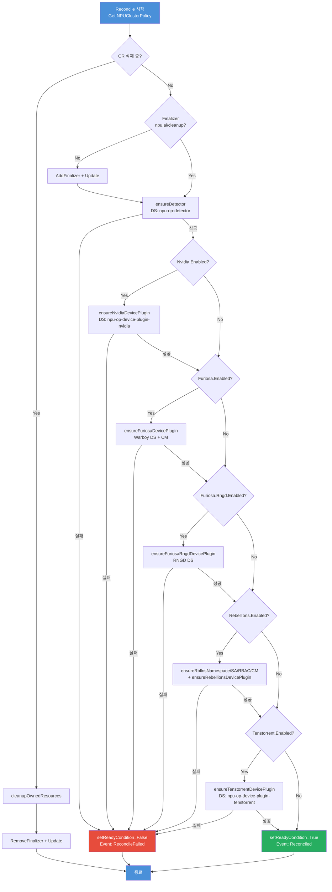
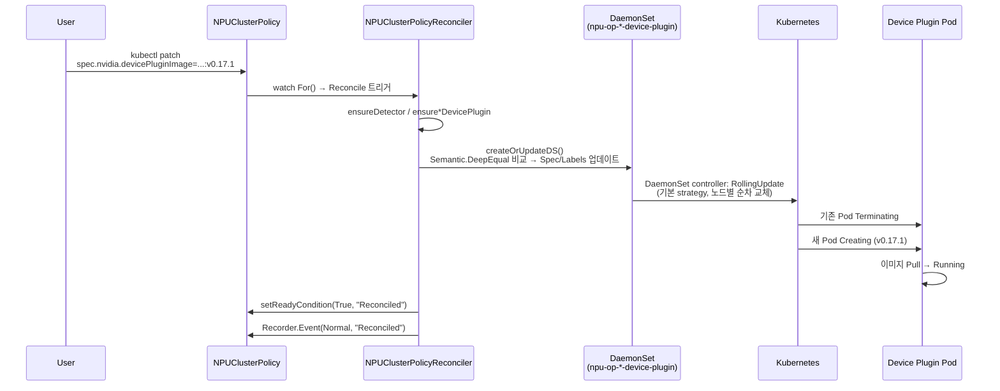
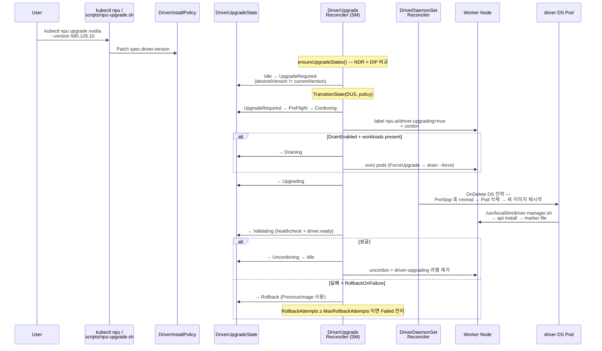
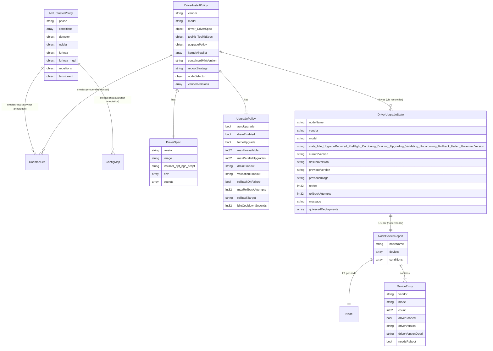
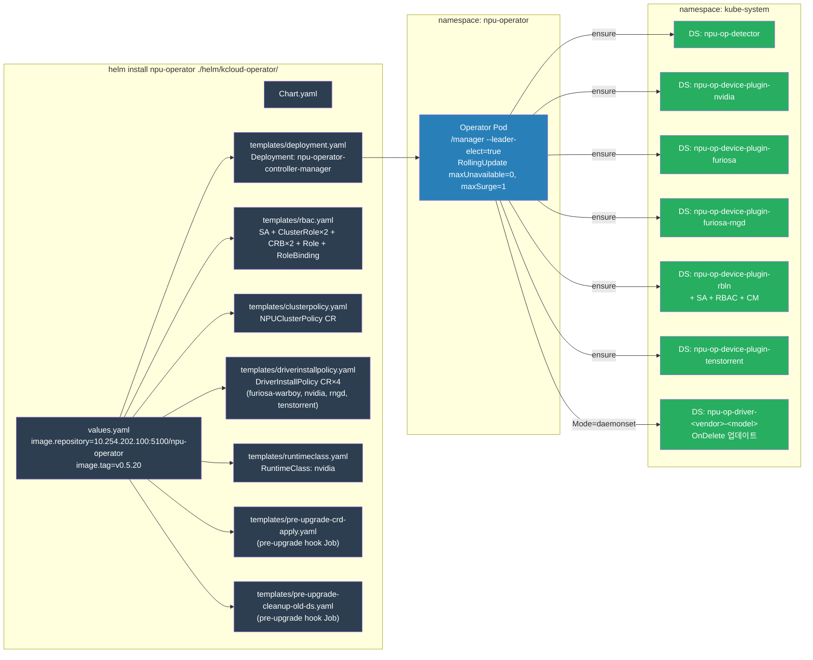
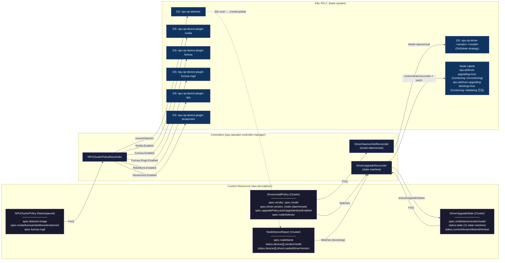

<!--
============================================================
05_architecture_reference.md: NPU Operator 아키텍처 레퍼런스
상세: Mermaid 다이어그램 전집 + 배포 토폴로지 신규 작성
생성일: 2026-04-17 | 수정일: 2026-05-14
============================================================
-->

# NPU Operator — 아키텍처 레퍼런스

---

## 0. Operator 한눈에

> **읽는 법**: 이 섹션은 §1~§3 의 상세 내용을 읽기 전에 전체 그림을 잡아주는 요약입니다.
> 각 항목 뒤의 §링크를 따라가면 상세 다이어그램·설명을 볼 수 있습니다.

### 0.1 NPU Operator 동작 과정 — 전체 파이프라인

```text
[운영자] helm install ./helm/kcloud-operator/    (values.yaml 만 만짐)
   │
   ▼  helm post-install hook (CRDs 4종 자동 apply + CR 자동 생성)
┌────────────────────────────────────────────────────────────────────┐
│ NPUClusterPolicy (NCP) ×1                                          │
│ DriverInstallPolicy (DIP) ×4 — furiosa-warboy / nvidia /           │
│                                rngd / tenstorrent                  │
│   (driver.mode=daemonset, Enum 강제)                               │
└────────────────────────────────────────────────────────────────────┘
   │
   ▼
[Operator Deployment]  npu-operator-controller-manager  (leader-elect=true, ns: npu-operator)
   │  └─ R1 / R3 / R4  세 Reconciler 호스트
   │
   ├─► R1: NPUClusterPolicyReconciler     .For(NCP)
   │      │
   │      ├─► ensureDetector
   │      │      └─► DS: npu-op-detector  (모든 노드)
   │      │             │
   │      │             ▼  PCI scan 30s
   │      │          [NodeDeviceReport (NDR) — 노드당 1개 갱신]
   │      │             status.devices[].{vendor, model,
   │      │                                driverLoaded, driverVersion}
   │      │
   │      └─► ensure{Nvidia, Furiosa, FuriosaRngd,
   │                 Rebellions, Tenstorrent}DevicePlugin
   │             └─► DS: npu-op-device-plugin-<vendor>  (벤더별)
   │                    nodeSelector = 운영자가 노드 프로비저닝 시
   │                    수동 부착한 벤더 라벨
   │                    (예: furiosa-rngd: "true",
   │                          nvidia.com/gpu.present: "true")
   │
   ├─► R3: DriverDaemonSetReconciler      .For(DIP)
   │      │  └─ Mode=daemonset 필터 (현재 유일 허용 값)
   │      │
   │      └─► createOrUpdateDriverDS
   │             └─► DS: npu-op-driver-<vendor>-<model>  (OnDelete 전략)
   │                    └─► driver Pod (privileged) — driver-manager.sh
   │                          → apt/dkms 로 호스트에 드라이버 설치
   │                          → /var/lib/npu-operator/driver.ready 마커
   │
   └─► R4: DriverUpgradeReconciler        .For(DUS)
          │                                + .Watches(DIP, NDR)
          │                                  (DUS 없으면 <node>-bootstrap dummy)
          │
          ├─► ensureUpgradeStates()  — NDR × DIP 매트릭스
          │      └─► DUS 생성/동기화 (노드×벤더 1쌍당 1개)
          │             status.{state, currentVersion, desiredVersion}
          │
          └─► TransitionState()  — 11-state SM
                 Idle → UpgradeRequired → PreFlight → Cordoning
                      → Draining → Upgrading → Validating → Uncordoning
                      → Idle
                 실패: Rollback → Failed | UnverifiedVersion (terminal)
                 │
                 ▼  Node 작업
              cordon → drain → driver Pod 삭제 → 새 이미지 재시작
                     → driver.ready 검증 → uncordon
                 → zero-downtime rolling upgrade
```

#### 파이프라인 용어 풀이

위 다이어그램에 나오는 키워드 7종을 짧게 정리한다. 상세 설명은 §1.1 / §1.4 / §3.2 에서 다시 다룬다.

##### ① `helm post-install hook` — 명령어가 아니라 annotation

별도 CLI 명령이 아니라, Helm 차트 manifest 에 `helm.sh/hook: post-install` annotation 을 붙여둔 리소스를 가리킨다. `helm install` 1회 호출 안에서 자동 실행된다:

```
helm install kcloud-operator …
  ├─ ① Deployment / RBAC / CRD 등 메인 리소스 설치
  └─ ② post-install hook 붙은 manifest 자동 apply
        → NCP ×1 + DIP ×4 자동 생성
```

운영자는 `kubectl apply -f ncp.yaml` 같은 후속 작업 없이 `helm install` 한 번으로 **operator + CRD + 초기 CR** 까지 일괄 세팅한다.

##### ② `driver.mode=daemonset (Enum 강제)`

`DIP.spec.driver.mode` 필드의 값. 현재 허용되는 값은 `daemonset` 하나뿐이며, CRD 스키마에 `+kubebuilder:validation:Enum=daemonset` 가 박혀 있다. 다른 값을 넣으면 **API 서버 admission 단계에서 reject** — 잘못된 mode 입력이 원천 차단된다. (과거 `job/init` 후보가 있었으나 §6 의 결정으로 제거됨.)

##### ③ `leader-elect=true`

controller-runtime 의 **리더 선출(leader election)** 옵션. operator Pod 가 여러 replica 거나 rolling-update 중 잠깐 겹치더라도 **단 1개 Pod 만 reconcile 루프를 실행**한다.

- 구현: K8s `coordination.k8s.io/Lease` 객체로 락 획득
- 효과: reconcile race condition 차단 + 리더 사망 시 다른 Pod 가 lease 인수 → failover

##### ④ `.For(<CR>)` — primary trigger source

controller-runtime 의 `SetupWithManager` 빌더 메서드. **"이 reconciler 가 책임지는 CR"** 을 등록한다. 해당 CR 에 create/update/delete 가 발생하면 reconciler 의 `Reconcile(ctx, req)` 가 자동 호출되고, `req.NamespacedName` 안에 변경된 CR 의 이름이 들어 있다.

R1 의 실제 코드 (`npuclusterpolicy_controller.go:1071`):

```go
func (r *NPUClusterPolicyReconciler) SetupWithManager(mgr ctrl.Manager) error {
    return ctrl.NewControllerManagedBy(mgr).
        For(&npuv1alpha1.NPUClusterPolicy{}).   // primary = NCP
        Named("npuclusterpolicy").
        Complete(r)
}
```

R3 의 실제 코드 (`driver_daemonset_controller.go:345`):

```go
func (r *DriverDaemonSetReconciler) SetupWithManager(mgr ctrl.Manager) error {
    return ctrl.NewControllerManagedBy(mgr).
        For(&npuv1alpha1.DriverInstallPolicy{}).   // primary = DIP
        Named("driverdaemonset").
        Complete(r)
}
```

##### ⑤ `.Watches(<CR>, mapFn)` — secondary trigger source

`.For()` 가 **내 우편함** 알림이라면, `.Watches()` 는 **이웃 우편함** 알림이다. 보조 리소스가 바뀌었을 때 "그럼 *어떤 primary CR* 의 reconcile 을 깨워야 하지?" 를 결정하는 변환 함수(`EnqueueRequestsFromMapFunc`)를 함께 등록한다.

R4 의 실제 코드 (`driver_upgrade_controller.go:294`, 발췌·축약):

```go
func (r *DriverUpgradeReconciler) SetupWithManager(mgr ctrl.Manager) error {
    return ctrl.NewControllerManagedBy(mgr).
        For(&v1alpha1.DriverUpgradeState{}).                          // ① primary = DUS
        Watches(                                                       // ② DIP 도 본다
            &v1alpha1.DriverInstallPolicy{},
            handler.EnqueueRequestsFromMapFunc(func(...) []reconcile.Request {
                // DIP 가 바뀌었네 → 같은 vendor 의 모든 DUS 를 깨워라
                pol := obj.(*v1alpha1.DriverInstallPolicy)
                var dusList v1alpha1.DriverUpgradeStateList
                mgr.GetClient().List(ctx, &dusList)
                for _, dus := range dusList.Items {
                    if dus.Spec.Vendor == pol.Spec.Vendor {
                        reqs = append(reqs, reconcile.Request{Name: dus.Name})
                    }
                }
                return reqs
            }),
        ).
        Watches(                                                       // ③ NDR 도 본다
            &v1alpha1.NodeDeviceReport{},
            handler.EnqueueRequestsFromMapFunc(r.mapNDRToUpgradeStates),
            // NDR 가 바뀌었네 → 해당 노드의 DUS 를 깨워라
            // (DUS 가 없으면 <node>-bootstrap 더미 1건으로 ensureUpgradeStates 트리거)
        ).
        Named("driverupgradestate").
        Complete(r)
}
```

세 trigger 의 역할 분담:

| 줄 | 트리거 시점 | 깨우는 대상 |
|---|---|---|
| `For(DUS)` | DUS 자체 변경 (status 갱신 등) | 그 DUS |
| `Watches(DIP, …)` | DIP 변경 (예: 이미지 태그 v1.2 → v1.3) | 같은 vendor 의 모든 DUS |
| `Watches(NDR, …)` | NDR 변경 (예: 새 노드에 NPU 카드 발견) | 그 노드의 DUS (없으면 부트스트랩 더미) |

**왜 세 개 모두 필요한가** — DUS 의 desired state 는 DIP 가 결정하고(이미지·버전), 존재 여부는 NDR 이 결정한다(노드에 그 디바이스가 실제로 꽂혀 있는가). 둘 다 watch 해야 §0.1 끝부분의 NDR × DIP 매트릭스가 항상 살아 있는 상태로 유지된다.

##### ⑥ `NDR × DIP 매트릭스`

R4 가 `ensureUpgradeStates()` 안에서 수행하는 **cross-join 비교**.

- **NDR** = 노드마다 detector 가 본 **실제 디바이스 목록** (현실)
- **DIP** = "이 vendor/model 에 이 driver 이미지를 깔겠다" 는 **선언** (원하는 상태)

(모든 노드 NDR) × (모든 벤더 DIP) 조합을 순회하면서, 각 셀에서 `vendor + model` 매칭이 성립하면 그 `(노드, 벤더)` 짝에 대해 **DUS 1개** 를 생성/유지한다.

```
            DIP-furiosa-warboy   DIP-furiosa-rngd   DIP-nvidia-gpu   DIP-tt-blackhole
NDR rngd-1        ✗                  ✓ DUS              ✗               ✗
NDR gpu-1         ✗                  ✗                  ✓ DUS           ✗
NDR atom-1        ✓ DUS              ✗                  ✗               ✗
```

한 줄 요약: **"어느 노드에 어느 드라이버를 설치해야 하는지"** 를 결정하는 비교 로직. 매트릭스는 매 reconcile 마다 순회되며, 결과 DUS 들이 §0.1 끝부분의 11-state SM 에 의해 zero-downtime 업그레이드를 수행한다.

### 0.2 핵심 3개 Reconciler

| Reconciler | `.For()` | `.Watches()` | 역할 |
|---|---|---|---|
| **R1: NPUClusterPolicyReconciler** | `NPUClusterPolicy` | — | Detector DS + 벤더별 Device Plugin DS (NVIDIA / Furiosa Warboy / Furiosa RNGD / Rebellions / Tenstorrent) `ensure*` |
| **R3: DriverDaemonSetReconciler** | `DriverInstallPolicy` | — | `Mode=daemonset` (Enum 강제) DIP 마다 driver DS (`OnDelete`) `createOrUpdateDriverDS` |
| **R4: DriverUpgradeReconciler** | `DriverUpgradeState` | `DIP`, `NDR` (+ `<node>-bootstrap` dummy) | 11-state SM (`Idle/UpgradeRequired/PreFlight/Cordoning/Draining/Upgrading/Validating/Uncordoning/Rollback/Failed/UnverifiedVersion`) — `cordon/drain/uncordon` 동반 zero-downtime upgrade |

### 0.3 CRD 4종 — 데이터 흐름

| CRD | Scope | 생성 주체 | 역할 |
|---|---|---|---|
| `NPUClusterPolicy` (NCP) | Namespaced | helm post-install hook (운영자가 작성한 values 기반) | "어떤 벤더를 켤지" 선언 (`spec.<vendor>.enabled`, `partitionPolicy`, image 등) |
| `NodeDeviceReport` (NDR) | Cluster | detector DS (노드당 1개, 30s polling) | "노드에 무엇이 꽂혀 있고 드라이버가 로드되었는지" 보고 (`status.devices[]`) |
| `DriverInstallPolicy` (DIP) | Cluster | helm post-install hook (4종) | "벤더/모델별 드라이버 `image`·`version`·`upgradePolicy`" 정책 |
| `DriverUpgradeState` (DUS) | Cluster | R4 `ensureUpgradeStates()` 가 노드×벤더 1쌍당 1개 자동 생성 | "노드×벤더 단위 업그레이드 진행 상태" (11-state SM, `currentVersion` vs `desiredVersion`) |

### 0.4 핵심 루프 — Reality vs Desired

Detector 가 본 **현실 (NDR)** 과 운영자가 선언한 **원하는 상태 (NCP / DIP)** 의 차이를
Reconciler 가 K8s 리소스로 **수렴**시키는 구조:

```text
       현실 (NDR)                                원하는 상태 (NCP / DIP)
  driverLoaded?  driverVersion?              spec.<vendor>.enabled?
   status.devices[]                          spec.driver.version, image, upgradePolicy
            │                                            │
            └─────────────► R1 / R3 / R4 ◄──────────────┘
                                │
                                ▼   ensure* / OnDelete DS / 11-state SM
                          K8s 리소스 수렴
                          (DS create/update + 노드 cordon/drain/uncordon)
```

핵심 가치:
- **Vendor 추상화** — NVIDIA / Furiosa / Rebellions / Tenstorrent 를 단일 NCP·DIP 모델로 통합
- **Zero-downtime upgrade** — 11-state SM + PDB-aware drain + node anti-affinity + rollback fallback
- **GitOps 친화** — `helm install` + `values.yaml` 만 만지면 클러스터 안 모든 K8s 리소스가 reconciler 로 자동 생성 (raw manifest 미사용)

### 0.5 배포 산출물 (Helm)

Helm chart `kcloud-operator` (v0.5.11 / appVersion v0.5.20) 가 다음을 한 번에 배포한다:

- `Deployment` — `npu-operator-controller-manager` (R1 / R3 / R4 호스트, leader-elect)
- `DaemonSet` — `npu-op-detector` (항상 실행, 모든 노드)
- `DaemonSet` × N — 벤더별 device plugin (NCP `enabled` 플래그에 따라 R1 이 조건부 생성)
- `DaemonSet` × M — 벤더별 driver installer (DIP 선언 수만큼, R3 가 OnDelete DS 로 생성)
- **CRD 4종** + RBAC + RuntimeClass + pre-upgrade hook Job 2종 (CRD apply / 구 DS cleanup)

> 상세 Mermaid 다이어그램은 §1, 컴포넌트 명세는 §2, 배포 토폴로지·이미지 경로는 §3 을 참조.

---

## 1. Mermaid 다이어그램 전집

### 1.1 전체 아키텍처

```mermaid
%% source: kcloud-operator/cmd/main.go, kcloud-operator/internal/controller/*.go, api/v1alpha1/*_types.go, helm/kcloud-operator/values.yaml; updated: 2026-04-23
%% fix: edge label 내 () + 특수문자 -->|"..."| 로 quote (mermaid parser 충돌)
graph TB
    subgraph CP["Control Plane (ns: npu-operator)"]
        OP["Deployment: npu-operator-controller-manager"]
        R1["NPUClusterPolicyReconciler"]
        R3["DriverDaemonSetReconciler<br/>(mode=daemonset)"]
        R4["DriverUpgradeReconciler<br/>(DUS 상태 머신)"]
        OP --> R1
        OP --> R3
        OP --> R4
    end

    subgraph CRD["CRDs (npu.ai/v1alpha1) — NCP: Namespaced, NDR·DIP·DUS: Cluster"]
        NCP["NPUClusterPolicy"]
        NDR["NodeDeviceReport"]
        DIP["DriverInstallPolicy<br/>+ UpgradePolicy"]
        DUS["DriverUpgradeState"]
    end

    NCP -->|"watches For()"| R1
    DIP -->|"watches For()"| R3
    DUS -->|"watches For()"| R4
    NDR -->|Watches| R4
    DIP -->|Watches| R4

    R1 -->|ensure| DS1["DS: npu-op-detector"]
    R1 -->|Nvidia.Enabled| DS2["DS: npu-op-device-plugin-nvidia"]
    R1 -->|Furiosa.Enabled| DS3["DS: npu-op-device-plugin-furiosa"]
    R1 -->|Furiosa.Rngd.Enabled| DS4["DS: npu-op-device-plugin-furiosa-rngd"]
    R1 -->|Rebellions.Enabled| DS5["DS: npu-op-device-plugin-rbln"]
    R1 -->|Tenstorrent.Enabled| DS6["DS: npu-op-device-plugin-tenstorrent"]
    R3 -->|creates OnDelete DS| DRVDS["DS: npu-op-driver-&lt;vendor&gt;-&lt;model&gt;"]
    R4 -->|cordon/drain/uncordon| NODE["Node"]

    subgraph W1["Worker Node (GPU — NVIDIA)"]
        DET1["detector Pod"]
        NDP["nvidia-device-plugin Pod"]
        DRV1["driver Pod<br/>(mode=daemonset, privileged)"]
        DET1 -->|"PCI scan 30s<br/>create/update NDR"| NDR
    end

    subgraph W2["Worker Node (NPU — Furiosa Warboy/RNGD)"]
        DET2["detector Pod"]
        FDP["furiosa-device-plugin Pod"]
        DRV2["driver Pod<br/>(mode=daemonset, privileged)"]
        DET2 -->|"PCI scan 30s<br/>create/update NDR"| NDR
    end

    subgraph W3["Worker Node (NPU — Rebellions / Tenstorrent)"]
        DET3["detector Pod"]
        RBP["rbln-device-plugin / tt-device-plugin Pod"]
        DET3 -->|PCI scan 30s| NDR
    end

    DS1 --> DET1
    DS1 --> DET2
    DS1 --> DET3
    DS2 --> NDP
    DS3 --> FDP
    DS4 --> FDP
    DS5 --> RBP
    DS6 --> RBP
    DRVDS --> DRV1
    DRVDS --> DRV2

    classDef cp fill:#1a1a2e,color:#fff
    classDef w1 fill:#16213e,color:#fff
    classDef w2 fill:#0f3460,color:#fff
    classDef w3 fill:#4a235a,color:#fff
    classDef crd fill:#2c3e50,color:#fff
    class OP,R1,R3,R4 cp
    class DET1,NDP,DRV1 w1
    class DET2,FDP,DRV2 w2
    class DET3,RBP w3
    class NCP,NDR,DIP,DUS crd
```


**라벨 의미 — 공통 약속 (이하 모든 다이어그램 적용)**

| 화살표/라벨 | 의미 |
|---|---|
| `watches For()` | controller-runtime 의 `.For(&CR{})` — 해당 CR 변경(생성/수정/삭제) 이벤트를 Reconcile 트리거 source 로 등록 |
| `Watches` | controller-runtime 의 `.Watches(...)` — 보조 source. 변경 시 reconcileFunc 으로 부모 CR 의 NamespacedName 을 enqueue |
| `ensure*` | reconcile 본체 함수 — desired state 와 실제 state 비교 후 create/update |
| `creates OnDelete DS` | DaemonSet UpdateStrategy=OnDelete — Pod 자동 삭제 안 함, 수동/외부 트리거로 교체 |
| `cordon/drain/uncordon` | Node 작업 — drain 전 cordon, drain 후 uncordon. 워크로드 evict 와 함께 수행 |
| `PCI scan 30s` | detector Pod 가 /sys/bus/pci 스캔 후 30 초 주기로 NDR status.devices 갱신 |
| `create/update NDR` | detector → NodeDeviceReport CR 의 create-or-update (kubectl apply 등가) |
| `ensureUpgradeStates` | NDR×DIP 매트릭스를 비교해 노드×벤더 단위 DriverUpgradeState 생성/동기화 |

**§1.1 고유 라벨**

| 화살표/라벨 | 의미 |
|---|---|
| `Nvidia.Enabled` / `Furiosa.Enabled` / … | NPUClusterPolicy.spec.<vendor>.enabled=true 조건 분기 — R1 이 해당 DS 를 ensure |
| `PCI scan 30s / create/update NDR` | detector Pod → NDR CR 30s 주기 갱신 |
| `--` (label 없음, DS→Pod) | DaemonSet 이 해당 Pod 를 관리(ownerRef) |

#### 키워드 풀이 — `watches For()` / `Watches` / `ensure*`

> **`watches For()`** — `controller-runtime` 의 `SetupWithManager` 내 `.For(&CR{})` 호출.
> 해당 CR 의 **생성·수정·삭제** 이벤트를 Reconciler 의 주(primary) 트리거 source 로 등록한다.
> 변경된 CR 의 `NamespacedName` 이 workqueue 에 enqueue → `Reconcile(ctx, req)` 호출.
>
> **`Watches`** — `.Watches(&SecondaryResource{}, handler.EnqueueRequestsFromMapFunc(...))` 형태의 보조(secondary) source.
> 보조 리소스 변경 시 **부모 CR** 의 NamespacedName 을 workqueue 에 enqueue 하는 방식으로,
> 다수의 CR 종류를 하나의 Reconciler 가 감시할 때 사용한다.
> 예) `DriverUpgradeReconciler` 가 `NodeDeviceReport` 와 `DriverInstallPolicy` 를 함께 감시.
>
> **`ensure*()`** — reconcile 본체 내 헬퍼 함수 패밀리 (`ensureDetector`, `ensureNvidiaDevicePlugin`, …).
> desired state(CRD spec) 와 실제 cluster state 를 비교(Semantic.DeepEqual)하여
> 불일치 시 **create or update** 를 수행하고, 일치 시 no-op 으로 빠른 반환.

```go
// 패턴 예시 (pseudocode)
func (r *Reconciler) ensureDetector(ctx context.Context, ncp *v1alpha1.NPUClusterPolicy) error {
    desired := r.buildDetectorDS(ncp)
    existing := &appsv1.DaemonSet{}
    err := r.Get(ctx, client.ObjectKeyFromObject(desired), existing)
    if apierrors.IsNotFound(err) {
        return r.Create(ctx, desired)
    }
    if !equality.Semantic.DeepEqual(existing.Spec, desired.Spec) {
        existing.Spec = desired.Spec
        return r.Update(ctx, existing)
    }
    return nil
}
```

---

### 1.2 Reconcile 흐름 — NPUClusterPolicyReconciler


**라벨 의미**

| 화살표/라벨 | 의미 |
|---|---|
| `Yes` / `No` | 조건 분기 — 다이아몬드 결정 노드의 출력 |
| `실패` / `성공` | ensureXxx() 함수 반환값 기반 분기 |
| `ensureDetector` / `ensureNvidiaDevicePlugin` / … | 각 벤더 DS create-or-update 함수 (`ensure*` 공통 규칙 적용) |
| `setReadyCondition=True/False` | NPUClusterPolicy.status.conditions 갱신 + Kubernetes Event 발행 |

#### 키워드 풀이 — `setReadyCondition` vs `Recorder.Event`

> **`setReadyCondition(status, reason, message)`** — `NPUClusterPolicy.status.conditions` 배열에
> `type: Ready` 컨디션을 upsert 하는 헬퍼.
> `status=True` → 모든 ensure* 성공 후, `status=False` → 어느 단계라도 에러 발생 시 호출.
> 이 값은 `kubectl get npuclusterpolicy -o yaml` 의 `.status.conditions` 에서 확인 가능.
>
> **`Recorder.Event(obj, eventType, reason, message)`** — `client-go` 의 `record.EventRecorder` 를 통해
> Kubernetes **Event** 오브젝트를 생성하는 호출 (`kubectl get events -n <ns>` 에서 조회 가능).
> `eventType` 은 `Normal` / `Warning` 중 하나.
> `setReadyCondition` 이 **조건(Condition) 필드 갱신**이라면, `Recorder.Event` 는 **감사 로그** 역할.
>
> | 구분 | 저장 위치 | 지속성 | 용도 |
> |------|----------|--------|------|
> | `setReadyCondition` | CR `.status.conditions[]` | CR 이 존재하는 한 영속 | 현재 상태 스냅샷 |
> | `Recorder.Event` | Kubernetes Event (etcd) | 기본 1시간 TTL | 변경 이력·감사 |

---

### 1.3 Device Plugin Rolling Update 흐름


**라벨 의미**

| 화살표/라벨 | 의미 |
|---|---|
| `->>` | sequenceDiagram 동기 메시지 (호출 방향) |
| `watch For() → Reconcile 트리거` | NPUClusterPolicy 변경 감지 → Reconcile 루프 진입 |
| `createOrUpdateDS()` | Semantic.DeepEqual 비교 후 spec/labels 불일치 시 Update |
| `RollingUpdate` | K8s DaemonSet 기본 전략 — maxUnavailable=1, 노드별 순차 교체 |


---

### 1.4 드라이버 버전 업그레이드 흐름


**라벨 의미**

| 화살표/라벨 | 의미 |
|---|---|
| `->>` | sequenceDiagram 동기 메시지 |
| `Patch spec.driver.version` | DIP CR 을 kubectl/API 로 직접 수정 — 업그레이드 트리거 |
| `ensureUpgradeStates()` | NDR×DIP 매트릭스 비교 → DUS 생성/상태 동기화 (`ensureUpgradeStates` 공통 규칙 적용) |
| `Idle → UpgradeRequired` / `→ PreFlight` / … | DriverUpgradeState 의 11-stage 상태 머신 전이 |
| `OnDelete DS 전략` | driver DS Pod 를 수동 삭제해야 새 이미지로 재시작 — zero-downtime 보장 |
| `apt install → marker file` | driver-manager.sh 실행 흐름: 패키지 설치 후 /var/lib/npu-operator/<vendor>.dpkg 마커 작성 |
| `alt` / `else` | sequenceDiagram 조건 블록 (DrainEnabled 여부, 성공/실패 분기) |

#### 키워드 풀이 — `Patch spec.driver.version` / `ensureUpgradeStates()`

> **`Patch spec.driver.version`** — `DriverInstallPolicy` CR 의 `.spec.driver.version` 필드를
> `kubectl patch` 또는 API 호출로 변경하는 행위.
> 이것이 **업그레이드의 유일한 트리거**이며, GitOps 워크플로에서는 DIP manifest 수정 후 apply.
> DriverDaemonSetReconciler 가 이 변경을 감지(watches For())하여 드라이버 DS 를 업데이트한다.
>
> **`ensureUpgradeStates()`** — `DriverUpgradeReconciler.Reconcile()` 내부의 핵심 함수.
> `NodeDeviceReport` (노드별 감지 장치 목록) × `DriverInstallPolicy` (벤더별 설치 정책) 의
> **카르테지안 곱(Cartesian product)**을 순회하며, 각 (node, vendor) 쌍에 대해
> `DriverUpgradeState` CR 을 생성하거나 기존 상태를 동기화한다.
>
> | 단계 | 역할 |
> |------|------|
> | NDR × DIP 매트릭스 순회 | 노드·벤더 조합별 DUS 존재 여부 확인 |
> | DUS 없음 → Create | 초기 `Idle` 상태로 DUS 생성 |
> | DUS 있음 → 상태 전이 판단 | `spec.driver.version` 변경 감지 시 `UpgradeRequired` 로 전이 |
> | 상태 머신 실행 | `PreFlight → Cordoning → Draining → … → Uncordoning → Idle` 11단계 순차 처리 |
>
> `ensureUpgradeStates` 는 `ensure*` 공통 패턴(desired vs actual 비교)의 **상태 머신 확장판**으로,
> 단순 create-or-update 를 넘어 노드 드레인·언코돈까지 오케스트레이션한다.

---

### 1.5 CRD 관계도


**라벨 의미**

| 표기 | 의미 |
|---|---|
| `\|\|--o{` | 1 대 0..N (한 CR 이 0 개 이상의 리소스를 소유) |
| `\|\|--\|\|` | 1 대 1 |
| `\|\|--o\|` | 1 대 0..1 (선택적 관계) |
| `\|\|--\|{` | 1 대 1..N (최소 1 개) |
| `"creates (npu.ai/owner annotation)"` | Operator 가 생성 시 npu.ai/owner 어노테이션으로 소유 관계 표시 |
| `"drives (via reconciler)"` | DriverUpgradeReconciler 가 DIP 를 읽어 DUS 를 생성·전이 |


---

### 1.6 Helm 배포 구조


**라벨 의미**

| 화살표/라벨 | 의미 |
|---|---|
| `-->` (label 없음) | values.yaml 설정 → 각 템플릿 렌더링 (Helm 템플릿 의존) |
| `ensure` | Operator Pod 가 reconcile 에서 DS create-or-update |
| `Mode=daemonset` | DIP.spec.driver.mode=daemonset 조건 — Driver DS 생성 |


---

### 1.7 프로젝트 디렉토리 구조

```mermaid
%% source: tree ./ (operator/), wc -l kcloud-operator/internal/controller/*.go; updated: 2026-05-13
graph TD
    ROOT["operator/"] --> OP["kcloud-operator/<br/>(Go module)"]
    ROOT --> UTIL["util/"]
    ROOT --> DOCS["docs/"]
    ROOT --> HELM["helm/kcloud-operator/"]
    ROOT --> SCRIPTS["scripts/"]
    ROOT --> CMDX["cmd/kubectl-npu/"]

    OP --> API["api/v1alpha1/<br/>NPUClusterPolicy, NodeDeviceReport,<br/>DriverInstallPolicy, DriverUpgradeState"]
    OP --> CTRL["internal/controller/<br/>npuclusterpolicy_controller.go (1121줄)<br/>driver_daemonset_controller.go (355줄)<br/>driver_upgrade_controller.go (524줄)"]
    OP --> UPG["internal/upgrade/<br/>UpgradeStateMachine"]
    OP --> MAIN["cmd/main.go"]

    UTIL --> DET["node-device-detector/<br/>main.go (PCI scanner, 30s)"]
    UTIL --> DI["driver-installer/<br/>furiosa-warboy/ | furiosa-rngd/ | nvidia/ | tenstorrent/"]
    UTIL --> TTDP["tenstorrent-device-plugin/<br/>(재작성, Blackhole gRPC 5 RPC)"]
    UTIL --> DKI["docker-images/<br/>테스트/릴리스 Dockerfiles + build/push"]
    UTIL --> TESTER["tester/<br/>E2E test harness + tmux 4-pane"]

    HELM --> TMPL["templates/<br/>deployment, rbac, clusterpolicy,<br/>driverinstallpolicy, runtimeclass,<br/>pre-upgrade-crd-apply, pre-upgrade-cleanup-old-ds"]
    HELM --> CHART["Chart.yaml + values.yaml<br/>(chart 0.5.11 / appVersion v0.5.20)"]

    CMDX --> CLI["kubectl-npu<br/>status / driver-version / upgrade"]

    SCRIPTS --> NUS["npu-upgrade.sh"]
    SCRIPTS --> TRS["test-rolling-update.sh"]

    classDef root fill:#e74c3c,color:#fff
    classDef mod fill:#3498db,color:#fff
    classDef util fill:#2ecc71,color:#fff
    classDef docs fill:#f39c12,color:#fff
    classDef plg fill:#9b59b6,color:#fff
    class ROOT root
    class OP,API,CTRL,UPG,MAIN mod
    class UTIL,DET,DI,TTDP,DKI,TESTER util
    class DOCS,HELM,TMPL,CHART docs
    class CMDX,CLI,SCRIPTS,NUS,TRS plg
```


**라벨 의미**

| 화살표/라벨 | 의미 |
|---|---|
| `-->` (label 없음) | 디렉토리/파일 포함 관계 (부모 → 자식) |
| `← sub-repo` | 별도 git 저장소로 관리되는 서브 모듈 경계 |


---

## 2. 컴포넌트 아키텍처

### 2.1 인벤토리

| 컴포넌트 | 종류 | 네임스페이스 | 이미지 |
|----------|------|-------------|--------|
| `npu-operator-controller-manager` | Deployment | `npu-operator` | `10.254.202.100:5100/npu-operator:v0.5.20` |
| `npu-op-detector` | DaemonSet | `kube-system` | `10.254.202.100:5100/npu-op-detector:<tag>` |
| `npu-op-device-plugin-nvidia` | DaemonSet | `kube-system` | `10.254.202.100:5100/npu-op-nvidia-device-plugin:<tag>` |
| `npu-op-device-plugin-furiosa` | DaemonSet | `kube-system` | `10.254.202.100:5100/npu-op-furiosa-device-plugin:<tag>` |
| `npu-op-device-plugin-furiosa-rngd` | DaemonSet | `kube-system` | `10.254.202.100:5100/npu-op-furiosa-rngd-device-plugin:<tag>` |
| `npu-op-device-plugin-rbln` | DaemonSet | `kube-system` | `10.254.202.100:5100/npu-op-rbln-device-plugin:<tag>` |
| `npu-op-device-plugin-tenstorrent` | DaemonSet | `kube-system` | `10.254.202.100:5100/npu-op-tenstorrent-device-plugin:<tag>` |
| `npu-op-driver-furiosa-rngd` | DaemonSet (OnDelete) | `kube-system` | `10.254.202.100:5100/furiosa-rngd-driver-installer:<tag>` — host 드라이버 설치 (nsenter 패턴) |
| **`npu-op-driver-tenstorrent-blackhole`** | **DaemonSet (OnDelete)** | **`kube-system`** | **`10.254.202.100:5100/tenstorrent-driver-ds:0.1.1`** — tt-kmd 드라이버 설치 (DKMS 패턴), DIP `tenstorrent-blackhole-ds` **(helm v0.5.11~)** |
| ~~`furiosa-driver-ds-rngd`~~ *(deprecated)* | — | — | **deprecated** (helm v0.5.9 까지) — `furiosa-rngd-driver-installer` 로 일원화 |
| `kubectl-npu` | CLI 플러그인 | — (로컬) | Go 빌드 바이너리 |

### 2.2 각 컴포넌트의 역할·동작·상호관계

#### A. `npu-operator-controller-manager` — 통합 reconciler 호스트

- **위치**: namespace `npu-operator`, Deployment 1 replica (leader election)
- **포함된 reconciler 3종** (cmd/main.go 에서 등록)
  | Reconciler | Watch 대상 | 책임 |
  |---|---|---|
  | `NPUClusterPolicyReconciler` | `NPUClusterPolicy` (CR) | detector DS, device plugin DS, Rebellions ns/RBAC/ConfigMap ensure |
  | `DriverDaemonSetReconciler` | `DriverInstallPolicy` + driver DS (`*-driver-*`) | DIP 기반 driver DS 생성, image tag 변경 감지 → rolling update 트리거 |
  | `DriverUpgradeReconciler` | `DriverUpgradeState` | 11-state state machine (Idle → UpgradeRequired → PreFlight → Cordoning → Draining → Upgrading → Validating → Uncordoning → Idle; 실패 분기: Rollback/Failed/UnverifiedVersion) |
- **상호관계**: `helm install` → NCP·DIP CR 생성 → reconciler 가 모든 DS/Job 자동 배포·갱신. 사용자는 `values.yaml` 만 만지고 클러스터 안 리소스는 직접 만지지 않음.
- **상세**: [§4.3 `kcloud-operator/`](#43-kcloud-operator--sub-repo-내부), `docs/06_operator_v1.4.md` (state machine), `docs/07_driver_lifecycle.md` (롤링 업그레이드)

#### B. `npu-op-detector` (DaemonSet) — 노드 device 인벤토리 수집

- **이미지**: `npu-op-detector:<tag>` (Go 단일 모듈, `util/node-device-detector/main.go`)
- **동작**: 30 초 polling — 컨테이너에 host `/proc`, `/sys`, `/dev`, `/var` 를 마운트해 PCI vendor ID 스캔
  - NVIDIA (0x10de) / Furiosa (0x1ed2) / Rebellions (0x18a4) / Tenstorrent (0x1e52) 식별
  - 드라이버 로드 여부·버전을 함께 추출
- **출력**: 노드당 `NodeDeviceReport` CR 1개 (cluster-scoped) — `spec.devices[]` 에 vendor/model/PCI addr/driverLoaded/driverVersion
- **상호관계**: NCP reconciler 가 DS 생성 → 매 30s NDR 갱신 → DriverDaemonSetReconciler 가 DIP watch 해서 driver DS 생성 결정. detector 자체는 NCP 의 `enabled` 와 무관하게 모든 노드에서 동작.

#### C. Device Plugin DaemonSets (벤더 5종)

| Plugin | Resource name (Pod 요청 시) | 이미지 출처 |
|---|---|---|
| `npu-op-device-plugin-nvidia` | `nvidia.com/gpu` | NVIDIA NGC (`nvcr.io/nvidia/k8s-device-plugin`) |
| `npu-op-device-plugin-furiosa` | `furiosa.ai/warboy` | 사내 registry |
| `npu-op-device-plugin-furiosa-rngd` | `furiosa.ai/rngd` | 사내 registry (`furiosa-device-plugin-mi`, multi-instance) |
| `npu-op-device-plugin-rbln` | `rebellions.ai/atom` | 사내 registry |
| `npu-op-device-plugin-tenstorrent` | `tenstorrent.com/blackhole` | 사내 registry |

- **공통 인터페이스**: kubelet gRPC 4 RPC (`ListAndWatch`, `Allocate`, `GetDevicePluginOptions`, `PreStartContainer`) — `docs/14_device_plugin_guide.md` 에 상세 8-step 구현 가이드
- **노드 선택**: 각 DS 는 `nodeSelector` 로 해당 벤더 라벨 (예: `furiosa-rngd: "true"`, `nvidia.com/gpu.present: "true"`) 매칭 노드에서만 실행. 이 벤더 라벨은 **운영자가 노드 프로비저닝 단계에서 수동으로 부착**한다 (operator 가 부여하지 않음). operator 가 관리하는 라벨은 `npu.ai/driver-upgrading*` (driver upgrade 사이클 한정) 뿐.
- **상호관계**: NCP reconciler 의 `ensureNvidiaDevicePlugin()`, `ensureFuriosaRngdDevicePlugin(partitionPolicy)` 등이 `policy.spec.<vendor>.enabled=true` 인 경우에만 DS 생성. `enabled=false` 면 DS 삭제.

#### D. Driver Installer DaemonSets (벤더 4종)

| Installer | 설치 방식 |
|---|---|
| `npu-op-driver-nvidia-generic` | APT + DKMS + nvidia-ctk (containerd CDI/런타임 등록) |
| `npu-op-driver-furiosa-warboy` | APT (Furiosa secret 필요) |
| `npu-op-driver-furiosa-rngd` | APT (드라이버 모듈 + furiosa-smi) |
| `npu-op-driver-tenstorrent-blackhole` *(helm v0.5.11+)* | tt-kmd DKMS |

- **공통 패턴**: privileged + `nsenter --target 1` 으로 host PID namespace 진입 → 패키지 설치 → marker file (`/var/lib/npu-operator/<vendor>.dpkg`) 작성 → readinessProbe 통과 후 **무한 sleep** (long-running 패턴 — DaemonSet 으로 영구 상주)
- **OnDelete 업데이트 전략**: image 변경 시 DriverDaemonSetReconciler 가 변경 감지 → DriverUpgradeReconciler 의 11-state 머신이 노드별 라벨 gating + PDB-aware drain + 순차 재시작으로 **zero-downtime** 보장
- **상호관계**: NDR ↔ DIP 매칭 (vendor + model) → DS 생성. 이미지 태그 변경 → DUS 가 stage 진행 (Pending → Validating → Completed). 자세한 라이프사이클은 `docs/07_driver_lifecycle.md`.

#### E. `kubectl-npu` (CLI 플러그인)

- **위치**: `cmd/kubectl-npu/` (독립 Go 모듈) → `$PATH` 에 두면 `kubectl npu …` 동작
- **서브명령**: `status` (CRD/CR 요약), `diag` (트러블슈팅 진단), `upgrade <vendor> <version>` (DIP image tag patch wrapper — `scripts/npu-upgrade.sh` 의 Go 포팅)
- **상호관계**: 클러스터 외부 도구 — operator/reconciler 가 호출하지 않음. 운영자가 진단·업그레이드 트리거용으로 사용.

### 2.3 operator 가 생성·관리하는 K8s 리소스 카탈로그

#### CRDs (4종, helm pre-upgrade hook 으로 자동 apply)

| CRD | scope | shortName | 생성 주체 | 역할 |
|---|---|---|---|---|
| `NPUClusterPolicy` (`npu.ai/v1alpha1`) | Cluster | `ncp` | helm post-install hook (운영자 1개) | 클러스터 전역 정책 — 벤더 enable, 이미지 태그, partition policy, RuntimeClass 설정 |
| `NodeDeviceReport` (`npu.ai/v1alpha1`) | Cluster | `ndr` | detector DS (노드 1개당 1개) | 노드별 device 인벤토리 (vendor/model/PCI addr/driverLoaded/driverVersion) |
| `DriverInstallPolicy` (`npu.ai/v1alpha1`) | Cluster | `dip` | helm post-install hook (벤더 enable 한 수만큼) | 벤더×모델 매칭 + driver 이미지 + mode=daemonset + upgradePolicy(immediate/manual) |
| `DriverUpgradeState` (`npu.ai/v1alpha1`) | Cluster | `dus` | DriverUpgradeReconciler ((node,vendor) 1쌍당 1개 자동 생성) | 11-state 업그레이드 상태 머신 (Idle/UpgradeRequired/PreFlight/Cordoning/Draining/Upgrading/Validating/Uncordoning/Rollback/Failed/UnverifiedVersion) |

#### CR 인스턴스 (실 운영 상태)

| 종류 | 갯수 | 출처 |
|---|---|---|
| `NPUClusterPolicy` | 1 (`npuclusterpolicy-sample`) | helm post-install hook (values.yaml 기반) |
| `NodeDeviceReport` | 노드 수만큼 (N) | detector DS 가 30s polling 으로 갱신 |
| `DriverInstallPolicy` | 벤더 enable 수만큼 (4~5) | helm post-install hook |
| `DriverUpgradeState` | DIP 1:1 (4~5) | DriverUpgradeReconciler 가 DIP 발견 시 자동 생성 |

#### Workloads (operator 가 reconcile 로 생성)

| Kind | 갯수 | 비고 |
|---|---|---|
| Deployment | 1 | `npu-operator-controller-manager` (`npu-operator` ns) |
| DaemonSet | 5~10 | detector 1 + device plugin 1~5 + driver installer 0~4 (벤더 enable 수에 따라) |

#### RBAC (helm templates + operator 가 둘 다 생성)

| Resource | 출처 |
|---|---|
| ClusterRole / ClusterRoleBinding (controller-manager, detector, metrics_auth, metrics_reader) | helm templates/rbac.yaml |
| Role / RoleBinding (leader_election) | helm templates/rbac.yaml |
| ServiceAccount (controller-manager, detector) | helm templates/rbac.yaml |
| Rebellions 전용 ServiceAccount + ClusterRoleBinding | NCP reconciler 의 `ensureRbllnsServiceAccount` / `ensureRbllnsRBAC` (Atom+ 활성화 시) |

#### Misc

| Resource | 출처 | 용도 |
|---|---|---|
| RuntimeClass (`nvidia`) | helm templates/runtimeclass.yaml | GPU container runtime 지정 |
| ConfigMap (`/etc/pcidp/config.json`) | NCP reconciler 의 `ensureRbllnsConfigMap` | Rebellions device plugin 설정 |
| Namespace (`rebellions`) | NCP reconciler 의 `ensureRbllnsNamespace` | Atom+ 전용 격리 ns |

#### Node labels (operator 가 설정)

| Label | 설정 주체 | 의미 |
|---|---|---|
| `<vendor>-<model>: "true"` (예: `furiosa-rngd: "true"`) | 운영자 수동 부착 (operator 미부여) | device plugin DS / driver DS 의 nodeSelector 매칭 |
| `npu.ai/driver-upgrading: "true"` | DriverUpgradeReconciler (state_machine.cordonNode) | 업그레이드 사이클(Cordoning~Uncordoning) 추적 — stuck 라벨 자동 sweep |
| `npu.ai/driver-upgrading-blocking: "true"` | DriverUpgradeReconciler (state_machine.cordonNode) | Cordoning~Validating 진입 직전까지만 부착 — detector/device-plugin antiAffinity 로 rmmod 충돌 차단 |

#### 데이터 흐름 요약 (한 줄)

```
[운영자] helm install → [helm hook] NCP·DIP CR 생성
   ↓
[NCP reconciler]      → detector DS + device plugin DS ensure
[detector DS]         → NDR CR 갱신 (30s polling)
[DriverDS recon]      → DIP 매칭 → driver DS 생성
[DriverDS recon]      → image tag 변경 감지 → DUS Pending 진입
[DriverUpgrade recon] → 11-state 머신으로 zero-downtime rolling
   ↓
[운영자] kubectl-npu status / diag 로 관측
```

---

## 3. 배포 토폴로지

### 3.1 K8s 클러스터 구조

```mermaid
%% source: helm/kcloud-operator/values.yaml (image paths), kcloud-operator/internal/controller/*.go (DS names), driverInstallPolicies.{nvidia,furiosa,rngd}.driver.mode=daemonset; updated: 2026-04-23
graph TB
    subgraph CLUSTER["K8s 클러스터"]
        subgraph CP["Control Plane Node"]
            API_SRV["kube-apiserver"]
            ETCD["etcd"]
            SCHED["kube-scheduler"]
            CM["kube-controller-manager"]

            subgraph NS_OP["namespace: npu-operator"]
                OP_POD["Deployment: npu-operator-controller-manager<br/>10.254.202.100:5100/npu-operator:v0.5.20"]
            end
        end

        subgraph W1["Worker Node (GPU — NVIDIA)"]
            subgraph NS_KS1["namespace: kube-system"]
                DET_W1["DS Pod: npu-op-detector<br/>PCI scan 30s → NDR"]
                NV_W1["DS Pod: npu-op-device-plugin-nvidia"]
                DRV_W1["DS Pod: npu-op-driver-nvidia-generic<br/>(mode=daemonset, privileged)"]
            end
        end

        subgraph W2["Worker Node (NPU — Furiosa Warboy)"]
            subgraph NS_KS2["namespace: kube-system"]
                DET_W2["DS Pod: npu-op-detector"]
                FU_W2["DS Pod: npu-op-device-plugin-furiosa"]
                DRV_W2["DS Pod: npu-op-driver-furiosa-warboy"]
            end
        end

        subgraph W3["Worker Node (NPU — Furiosa RNGD)"]
            subgraph NS_KS3["namespace: kube-system"]
                DET_W3["DS Pod: npu-op-detector"]
                RNGD_W3["DS Pod: npu-op-device-plugin-furiosa-rngd"]
                DRV_W3["DS Pod: npu-op-driver-furiosa-rngd"]
            end
        end

        subgraph W4["Worker Node (Rebellions ATOM+ / Tenstorrent)"]
            subgraph NS_KS4["namespace: kube-system"]
                DET_W4["DS Pod: npu-op-detector"]
                RBLN_W4["DS Pod: npu-op-device-plugin-rbln<br/>or npu-op-device-plugin-tenstorrent"]
            end
        end
    end

    REG["사설 이미지 레지스트리<br/>10.254.202.100:5100"]

    OP_POD -->|creates/manages| DET_W1
    OP_POD -->|creates/manages| NV_W1
    OP_POD -->|creates/manages| DET_W2
    OP_POD -->|creates/manages| FU_W2
    OP_POD -->|creates/manages| DET_W3
    OP_POD -->|creates/manages| RNGD_W3
    OP_POD -->|creates/manages| DET_W4
    OP_POD -->|creates/manages| RBLN_W4
    OP_POD -.->|"Mode=daemonset DS"| DRV_W1
    OP_POD -.->|"Mode=daemonset DS"| DRV_W2
    OP_POD -.->|"Mode=daemonset DS"| DRV_W3

    REG -.->|image pull| OP_POD
    REG -.->|image pull| DRV_W1
    REG -.->|image pull| DRV_W2
    REG -.->|image pull| DRV_W3

    classDef cluster fill:#0d1117,color:#fff
    classDef cp fill:#1a1a2e,color:#fff
    classDef w1 fill:#16213e,color:#fff
    classDef w2 fill:#0f3460,color:#fff
    classDef w3 fill:#4a235a,color:#fff
    classDef reg fill:#1abc9c,color:#fff
    class CLUSTER cluster
    class CP cp
    class W1 w1
    class W2,W3 w2
    class W4 w3
    class REG reg
```


**라벨 의미**

| 화살표/라벨 | 의미 |
|---|---|
| `creates/manages` | Operator Pod 가 reconcile 로 DS 생성·유지 |
| `-.->` | 점선 — 런타임 의존 (image pull, daemonset pod 간접 실행) |
| `"Mode=daemonset DS"` | DIP mode=daemonset 조건으로 생성된 Driver DS |
| `image pull` | 컨테이너 이미지를 사설 레지스트리에서 pull |


---

### 3.2 CR(Custom Resource) 관계도



#### CR 필드 의미 — NCP / DIP / NDR / DUS

**NPUClusterPolicy (NCP)** — 클러스터 전역 정책 (api/v1alpha1/npuclusterpolicy_types.go)

| 필드 | 타입 | 의미 |
|---|---|---|
| `spec.detector.image` | string | node-device-detector DS 이미지 (PCI 스캔, NDR 갱신) |
| `spec.nvidia.enabled` | bool | NVIDIA GPU device plugin DS 생성 여부 |
| `spec.nvidia.devicePluginImage` | string | NVIDIA device plugin 이미지 (예: nvcr.io/nvidia/k8s-device-plugin) |
| `spec.nvidia.nodeSelector` | map | (선택) NVIDIA DS 의 추가 노드 셀렉터 |
| `spec.furiosa.enabled` | bool | Furiosa Warboy device plugin DS 생성 여부 |
| `spec.furiosa.devicePluginImage` | string | Furiosa Warboy device plugin 이미지 |
| `spec.furiosa.configMapName` | string | Furiosa device plugin 전용 ConfigMap 이름 |
| `spec.furiosa.rngd.enabled` | bool | Furiosa RNGD device plugin DS 생성 여부 (2nd-gen NPU) |
| `spec.furiosa.rngd.devicePluginImage` | string | RNGD device plugin 이미지 (furiosa-device-plugin-mi, multi-instance) |
| `spec.furiosa.rngd.resourceName` | string | K8s resource 이름 (default `furiosa.ai/rngd`) |
| `spec.furiosa.rngd.partitionPolicy` | enum | `none`/`single-core`/`dual-core`/`quad-core` — libfuriosa-kubernetes PartitioningPolicy 매핑 |
| `spec.rebellions.enabled` | bool | Rebellions ATOM+ device plugin DS 생성 여부 |
| `spec.rebellions.devicePluginImage` | string | Rebellions device plugin 이미지 |
| `spec.rebellions.resourceName` | string | K8s resource 이름 (default `ATOM`) — prefix 와 결합되어 `rebellions.ai/ATOM` |
| `spec.rebellions.resourcePrefix` | string | resource 그룹 prefix (default `rebellions.ai`) |
| `spec.rebellions.namespace` | string | Rebellions ns (default `rbln-system`) — Pod Security `privileged` 적용 |
| `spec.rebellions.configMapName` | string | `/etc/pcidp/config.json` 생성 시 사용할 ConfigMap 이름 (default `rbln-device-plugin-config`) |
| `spec.tenstorrent.enabled` | bool | Tenstorrent Blackhole device plugin DS 생성 여부 |
| `spec.tenstorrent.devicePluginImage` | string | Tenstorrent device plugin 이미지 (자체 구현, 5 RPC) |
| `spec.tenstorrent.resourceName` | string | K8s resource 이름 (default `tenstorrent.com/blackhole`) |
| `status.phase` | string | 종합 상태 (Ready/Progressing/Failed) |
| `status.conditions[]` | metav1.Condition[] | Ready/Reconciling 등 표준 condition |

**DriverInstallPolicy (DIP)** — 벤더·모델별 드라이버 설치 정책 (api/v1alpha1/driverinstallpolicy_types.go, cluster-scoped)

| 필드 | 타입 | 의미 |
|---|---|---|
| `spec.vendor` | string | 매칭 대상 벤더 (`furiosa`/`nvidia`/`rebellions`/`tenstorrent`) — NDR.status.devices[].vendor 와 매칭 |
| `spec.model` | string | 모델명 (`warboy`/`rngd`/`generic`/`blackhole` 등) — 비우면 vendor 만 매칭 |
| `spec.driver.version` | string | 설치 대상 드라이버 버전 (예: `1.9.8-3`, `580.142`) |
| `spec.driver.image` | string | 드라이버 인스톨러 컨테이너 이미지 (전체 ref, validation pattern 검증) |
| `spec.driver.installer` | enum | 설치 방식: `apt`/`ngc`/`script` |
| `spec.driver.mode` | enum | `daemonset` (CRD Enum 으로 강제, default=daemonset) |
| `spec.driver.env[]` / `spec.driver.secrets[]` / `spec.driver.extraHostMounts[]` | list | 인스톨러 환경변수·시크릿·호스트마운트 |
| `spec.toolkit.*` | object | NVIDIA Container Toolkit 등 런타임 툴킷 설치 (선택) |
| `spec.kernelAllowlist[]` | string[] | 허용 커널 버전 패턴 (예: `5.15.*`, `6.8.*`) |
| `spec.containerdMinVersion` | string | 최소 containerd semver |
| `spec.rebootStrategy` | enum | `Require`/`IfNeeded`/`Never` |
| `spec.nodeSelector` | map | (선택) DIP 적용 노드 한정 |
| `spec.upgradePolicy.autoUpgrade` | bool | 버전 mismatch 시 자동 업그레이드 트리거 여부 |
| `spec.upgradePolicy.drainEnabled` | bool | 업그레이드 전 cordon+drain 수행 여부 |
| `spec.upgradePolicy.forceUpgrade` | bool | drain --force 허용 여부 |
| `spec.upgradePolicy.maxUnavailable` | int32 | 동시 업그레이드 노드 수 (default 1) |
| `spec.upgradePolicy.drainTimeout` / `validationTimeout` | string | drain·validation 타임아웃 (예: `5m`, `2m`) |
| `spec.upgradePolicy.rollbackOnFailure` | bool | 실패 시 자동 롤백 |
| `spec.upgradePolicy.maxRollbackAttempts` | int32 | 롤백 반복 실패 한도 (default 3) — 초과 시 Failed |
| `spec.upgradePolicy.rollbackTarget` | enum | `previousValidated`/`spec` (default `spec` — legacy) |
| `spec.upgradePolicy.idleCooldownSeconds` | int32 | Idle 진입 후 다음 트리거 차단 기간 (default 10s) |
| `spec.verifiedVersions[]` | string[] | 검증된 버전 화이트리스트 — 비-멤버 지정 시 `UnverifiedVersion` 상태 |

**NodeDeviceReport (NDR)** — 노드별 device 인벤토리 (api/v1alpha1/nodedevicereport_types.go, cluster-scoped)

| 필드 | 타입 | 의미 |
|---|---|---|
| `spec.nodeName` | string | 이 리포트가 속하는 노드 이름 (immutable) |
| `status.devices[].vendor` | string | `furiosa`/`nvidia`/`rebellions`/`tenstorrent` — PCI vendor ID 매칭 결과 |
| `status.devices[].model` | string | `warboy`/`rngd`/`generic`/`blackhole` 등 |
| `status.devices[].count` | int32 | 해당 모델의 device 갯수 |
| `status.devices[].driverLoaded` | bool | 호스트에 드라이버 커널 모듈 로드 여부 |
| `status.devices[].driverVersion` | string | 설치된 드라이버 버전 (예: `1.9.8-3`) |
| `status.devices[].driverVersionDetail` | string | 한 줄 요약 상세 (modinfo 발췌) |
| `status.devices[].needsReboot` | bool | 재부팅 필요 여부 (드라이버 갱신 후 etc.) |
| `status.conditions[]` | Condition[] | `UpgradeInProgress`/`UpgradePending`/`CordonedForUpgrade`/`UpgradeSucceeded`/`UpgradeFailed` |

**DriverUpgradeState (DUS)** — 노드×벤더 1쌍당 1개 (api/v1alpha1/driverupgradestate_types.go, cluster-scoped)

| 필드 | 타입 | 의미 |
|---|---|---|
| `spec.nodeName` / `spec.vendor` / `spec.model` | string | 업그레이드 대상 식별자 (DUS 이름 = `<node>-<vendor>`) |
| `status.state` | enum | 11-state: Idle/UpgradeRequired/PreFlight/Cordoning/Draining/Upgrading/Validating/Uncordoning/Rollback/Failed/UnverifiedVersion |
| `status.currentVersion` / `status.desiredVersion` | string | 현재·목표 드라이버 버전 (Patch 전후) |
| `status.previousVersion` / `status.previousImage` | string | 롤백 기준 버전·이미지 (tag 치환 대신 원본 ref 보존) |
| `status.retries` | int32 | 현 사이클의 일반 재시도 횟수 |
| `status.rollbackAttempts` | int32 | 현 사이클의 롤백 시도 횟수 (≥ MaxRollbackAttempts 시 Failed) |
| `status.lastTransitionTime` | metav1.Time | 마지막 상태 전이 시각 (stuck label sweep 의 기준) |
| `status.message` | string | 현 상태 부가 설명 (failure reason 등) |
| `status.quiescedDeployments[]` | list | Cordoning 시 `npu.ai/quiesce-on-driver-upgrade=true` 라벨이 붙은 Deployment 의 원래 replicas 백업 (Idle/Failed 진입 시 복구) |

**라벨 의미**

| 화살표/라벨 | 의미 |
|---|---|
| `"For()"` | .For(&CR{}) — 해당 CR 변경 이벤트를 Reconcile 트리거로 등록 (`watches For()` 공통 규칙 적용) |
| `"Watches (bootstrap)"` | 부팅 시 NDR 스캔으로 기존 DUS 동기화 — 이후에는 DUS.For() 로 구동 |
| `ensureDetector` / `ensureUpgradeStates` | reconcile 본체 함수 (`ensure*` 공통 규칙 적용) |
| `"Mode=daemonset"` | DIP.spec.driver.mode=daemonset 조건 — DS 생성 경로 |
| `"cordon/drain/uncordon + patch"` | state_machine.cordonNode/uncordonNode 가 `npu.ai/driver-upgrading*` 라벨 add/remove (`cordon/drain/uncordon` 공통 규칙 적용) |
| `-.->` | 점선 — 30s 주기 비동기 갱신 (`30s scan → create/update` NDR) |


---

### 3.3 배포 흐름 (Helm → 운영)

```mermaid
%% source: helm/kcloud-operator/templates/* (+ pre-upgrade hooks), values.yaml (crdUpgrade, deployClusterPolicy, driverInstallPolicies.*); updated: 2026-04-23
flowchart TD
    START["helm install/upgrade npu-operator<br/>./helm/kcloud-operator/"] --> CRD_HOOK

    subgraph CRD_HOOK["CRD 설치 (helm install: crds/ | helm upgrade: pre-upgrade Job)"]
        CRDS["CRDs 적용<br/>npuclusterpolicies, nodedevicereports,<br/>driverinstallpolicies, driverupgradestates"]
        CLEAN["pre-upgrade-cleanup-old-ds Job<br/>(구버전 DS 정리)"]
    end

    CRD_HOOK --> RBAC["rbac.yaml<br/>SA + ClusterRole×2 + CRB×2 + Role + RoleBinding"]
    RBAC --> DEPLOY["deployment.yaml<br/>Deployment: npu-operator-controller-manager<br/>(ns: npu-operator, replicas=1, --leader-elect=true)"]

    DEPLOY --> POST

    subgraph POST["Helm 템플릿 (CR 생성)"]
        NCP_CR["clusterpolicy.yaml<br/>NPUClusterPolicy CR<br/>(detector + nvidia/furiosa/rngd/rebellions/tenstorrent)"]
        DIP_CR["driverinstallpolicy.yaml<br/>DIP CR×4 (furiosa-warboy-ds, nvidia-gpu-ds, furiosa-rngd-ds, tenstorrent-blackhole-ds)<br/>모두 driver.mode=daemonset"]
        RTC["runtimeclass.yaml<br/>RuntimeClass: nvidia"]
    end

    POST --> R1["NPUClusterPolicyReconciler"]
    R1 --> DS_APPLY["Device Plugin DS 생성/적용:<br/>npu-op-detector (전 노드)<br/>npu-op-device-plugin-{nvidia,furiosa,furiosa-rngd,rbln,tenstorrent}"]

    DS_APPLY --> DETECT["detector: PCI 스캔 (30s 주기)<br/>→ NodeDeviceReport 생성/갱신"]

    DETECT --> R3["DriverDaemonSetReconciler"]
    R3 --> DRV_DS["driver DS 생성:<br/>npu-op-driver-&lt;vendor&gt;-&lt;model&gt;<br/>(OnDelete 업데이트 전략)"]
    DRV_DS --> DRV_READY["driver Pod:<br/>driver-manager.sh + apt install<br/>→ /var/lib/npu-operator/driver.ready"]

    DETECT --> R4["DriverUpgradeReconciler<br/>ensureUpgradeStates()"]
    R4 --> CHECK{"desiredVersion<br/>vs currentVersion"}
    CHECK -->|"일치"| LABEL["node 라벨 정리<br/>npu.ai/driver-upgrading* 제거 (stuck sweep)"]
    CHECK -->|"불일치 + autoUpgrade"| SM["State Machine (11-state):<br/>UpgradeRequired → PreFlight → Cordoning<br/>→ Draining → Upgrading → Validating<br/>→ Uncordoning → Idle<br/>(실패 시: Rollback → Failed, 또는 UnverifiedVersion)"]
    SM --> DRV_DEL["driver DS Pod 삭제 →<br/>OnDelete 재시작 (새 이미지)"]
    DRV_DEL --> LABEL

    LABEL --> READY["Ready=True<br/>NPUClusterPolicyStatus.Conditions 갱신"]

    classDef start fill:#2c3e50,color:#fff
    classDef hook fill:#1a1a2e,color:#fff
    classDef ok fill:#27ae60,color:#fff
    classDef warn fill:#e67e22,color:#fff
    class START start
    class CRD_HOOK,POST hook
    class READY,LABEL ok
    class SM,DRV_DEL warn
```


**라벨 의미**

| 화살표/라벨 | 의미 |
|---|---|
| `-->` (label 없음) | 순차 흐름 — 앞 단계 완료 후 다음 단계 |
| `"일치"` / `"불일치 + autoUpgrade"` | desiredVersion vs currentVersion 비교 결과 분기 |
| `State Machine (11-state):` | DriverUpgradeReconciler 의 11-state 전이 (Idle/UpgradeRequired/PreFlight/Cordoning/Draining/Upgrading/Validating/Uncordoning/Rollback/Failed/UnverifiedVersion) |
| `OnDelete 재시작` | driver DS Pod 수동 삭제 → DaemonSet 이 새 이미지로 재생성 |


---

### 3.4 이미지 레지스트리 경로

| 이미지 | 레지스트리 경로 | 용도 | 출처 | 수정 내용 |
|--------|----------------|------|------|-----------|
| Operator | `10.254.202.100:5100/npu-operator:<tag>` | Controller-Manager (Operator 본체) | `kcloud-operator/Dockerfile` — `FROM golang:1.24 AS builder` → `FROM gcr.io/distroless/static:nonroot` | 내부 빌드 (Go 소스 컴파일, distroless 최종 이미지) |
| Detector | `10.254.202.100:5100/npu-detector:<tag>` | PCI 스캔 → NodeDeviceReport 갱신 | `util/node-device-detector/Dockerfile` — `FROM golang:1.22 as build` → `FROM gcr.io/distroless/static:nonroot` | 내부 빌드 (Go 소스 컴파일, distroless 최종 이미지) |
| NVIDIA Device Plugin | `nvcr.io/nvidia/k8s-device-plugin:v0.17.1` | GPU 자원 K8s 광고 | `helm/kcloud-operator/values.yaml` `.nvidia.devicePluginImage` | **업스트림 원본 그대로 사용** — NVIDIA NGC 레지스트리에서 직접 Pull |
| Furiosa Device Plugin (Warboy) | `ghcr.io/furiosa-ai/k8s-device-plugin:0.10.1` | Warboy NPU 자원 K8s 광고 | `helm/kcloud-operator/values.yaml` `.furiosa.devicePluginImage` | **업스트림 원본 그대로 사용** — GHCR에서 직접 Pull |
| Furiosa Device Plugin (RNGD) | `10.254.202.100:5100/furiosaai/furiosa-device-plugin:2026.1.0` | RNGD NPU 자원 K8s 광고 | `helm/kcloud-operator/values.yaml` `.furiosa.rngd.devicePluginImage` | 사설 레지스트리 미러 (업스트림 이미지를 내부 레지스트리로 복사) |
| Rebellions Device Plugin | `10.254.202.100:5100/rebellions/k8s-device-plugin:v0.3.6` | RBLN NPU 자원 K8s 광고 | `helm/kcloud-operator/values.yaml` `.rebellions.devicePluginImage` | 사설 레지스트리 미러 |
| Tenstorrent Device Plugin | `10.254.202.100:5100/tenstorrent/k8s-device-plugin:v0.1.0` | Tenstorrent NPU 자원 K8s 광고 | `helm/kcloud-operator/values.yaml` `.tenstorrent.devicePluginImage` / `util/tenstorrent-device-plugin/Dockerfile` — `FROM golang:1.24-alpine AS builder` → `FROM scratch` | 내부 빌드 또는 사설 레지스트리 미러 (확인 필요 — values.yaml 참조) |
| Driver Installer (NVIDIA) | `10.254.202.100:5100/nvidia-driver-ds:580.142-v173` | nsenter로 호스트에 NVIDIA 드라이버 설치 | `util/driver-installer/nvidia/Dockerfile` — `FROM ubuntu:22.04` | 내부 빌드 (ubuntu:22.04 베이스, apt 패키지 + 설치 스크립트 포함) |
| Driver Installer (NVIDIA v17) | `10.254.202.100:5100/nvidia-driver-ds:<tag>` | nsenter로 호스트에 NVIDIA 드라이버(v17계열) 설치 | `util/driver-installer/nvidia/Dockerfile.v17` — `FROM ubuntu:22.04` | 내부 빌드 (Dockerfile.v17 별도 변형 — v17 드라이버 전용) |
| Driver Installer (Furiosa Warboy) | `10.254.202.100:5100/furiosa-driver-ds:<tag>` | nsenter로 호스트에 Furiosa Warboy 드라이버 설치 | `util/driver-installer/furiosa-warboy/Dockerfile` — `FROM ubuntu:22.04` | 내부 빌드 (ubuntu:22.04 베이스) |
| **Driver Installer (Furiosa RNGD)** | **`10.254.202.100:5100/furiosa-rngd-driver-installer:<tag>`** | nsenter로 호스트에 `furiosa-driver-rngd` + `furiosa-smi` 설치 | `util/driver-installer/furiosa-rngd/Dockerfile` — `FROM ubuntu:22.04` | 내부 빌드 (ubuntu:22.04 베이스, RNGD 전용 패키지 포함) |
| Driver Installer (Tenstorrent) | `10.254.202.100:5100/tenstorrent-driver-ds:<tag>` | nsenter로 호스트에 tt-kmd 드라이버 설치 | `util/driver-installer/tenstorrent/Dockerfile` — `FROM ubuntu:22.04` | 내부 빌드 (ubuntu:22.04 베이스, tt-kmd DKMS 포함) |
| ~~Driver DS 테스트 (Furiosa RNGD)~~ *(deprecated)* | ~~`10.254.202.100:5100/furiosa-driver-ds-rngd:<tag>`~~ | **deprecated** (helm v0.5.9 까지) | — | `furiosa-rngd-driver-installer` 로 일원화됨 |

> **분류 기준**
> - **내부 빌드**: 이 저장소의 Dockerfile 로 직접 빌드 → 사설 레지스트리 Push. `ubuntu:22.04` / `golang:1.2x` / `distroless` 를 베이스로 사용.
> - **업스트림 원본**: Dockerfile 없음, values.yaml 에 외부 레지스트리 경로가 직접 명시. 인터넷 Pull 필요.
> - **사설 레지스트리 미러**: 업스트림 이미지를 `10.254.202.100:5100` 으로 복사한 것. 에어갭(air-gap) 환경 대응 목적.

> **레지스트리**: 내부 사설 레지스트리 `10.254.202.100:5100` (외부 인터넷 불필요 — 단, 업스트림 원본 이미지 제외)

---

## 4. 소스코드 목록 (Source Code Inventory)
<!-- 추가일: 2026-05-18 — 디렉토리 카탈로그 + 자동생성·legacy 배지 -->

본 섹션은 `operator/` 저장소의 디렉토리·파일 별 역할과 관리 방식을 한눈에 정리한다.
각 파일/디렉토리 끝의 배지(✋📦🔁🚫🔒📥🪦📊)는 다음 §4.1 정의를 따른다.

> **참고 — "자동 생성" 의 두 의미**:
> Kubebuilder/operator-sdk 프로젝트에서 "자동 생성" 은 두 가지를 모두 가리킬 수 있다.
> 본 문서는 이 둘을 ✋ vs 📦 로 엄격히 구분한다.
>
> | 종류 | 배지 | 예 |
> |------|------|----|
> | **1회 스캐폴드 후 사용자 편집** — `operator-sdk init` / `create api` 가 빈 골격을 한 번 만들어 주고, 그 후 사용자가 로직 작성. 재실행해도 덮어쓰지 않음 | ✋ manual | `cmd/main.go`, `api/v1alpha1/*_types.go`, `internal/controller/*_controller.go`, `Makefile`, `Dockerfile`, `PROJECT` |
> | **매번 덮어씀** — `make generate` / `make manifests` / `make test` 가 매번 재생성. **직접 편집 금지** | 📦 generated | `zz_generated.deepcopy.go`, `config/crd/bases/*.yaml`, `config/rbac/role.yaml`, `cover.out` |

### 4.1 배지 정의

| 배지 | 의미 | 처리 규칙 |
|------|------|----------|
| ✋ manual | 사람이 직접 작성·수정 (1회 스캐폴드 후 사용자 편집 포함) | 일반 PR 으로 변경 |
| 📦 generated | 도구가 **매번 재생성** | **직접 수정 금지**, 원본 marker/소스 수정 후 재생성 |
| 🔁 mirror | 다른 곳에서 동기화 | `make sync-helm-crds` / `make embed-crds` 등으로 갱신 |
| 🚫 binary | 빌드 산출물 | git 추적 대상 아님 권장 |
| 🔒 lock | 도구 관리 lock/체크섬 | `go mod tidy` 등으로 갱신 |
| 📥 vendor | 외부 의존성 복사본 | 업스트림 갱신 후 vendor 재실행 |
| 🪦 legacy | 현 operator 가 미사용 (reference 보존) | **수동 apply 금지** |
| 📊 runtime | 운영 중 수집된 산출물 | `.gitignore` 대상 |
| ← sub-repo | 별도 git 저장소 | root repo 에서는 sub-tree |

### 4.1.1 생성 명령 ↔ 산출물 매핑

📦 generated 배지가 붙은 파일과 ✋ manual 중 1회 스캐폴드 산출물은 아래 명령들로 생성된다. 운영 중 직접 편집 금지 (📦) 또는 1회 한정 스캐폴드 (✋).

| # | 명령 | 산출 파일/디렉토리 | 종류 |
|---|------|-------------------|------|
| 1 | `operator-sdk init --domain ai --repo kcloud-operator --plugins go/v4` | `cmd/main.go`, `Makefile`, `Dockerfile`, `PROJECT`, `go.mod`, `hack/boilerplate.go.txt`, `config/{default,manager,prometheus,...}/*` 골격 | ✋ 1회 스캐폴드 |
| 2 | `operator-sdk create api --group npu --version v1alpha1 --kind <Kind> --resource --controller` | `api/v1alpha1/<kind>_types.go`, `internal/controller/<kind>_controller.go`, `internal/controller/suite_test.go`, `config/crd/patches/`, `config/samples/<kind>.yaml` 골격 | ✋ 1회 스캐폴드 (총 4개 kind: NPUClusterPolicy, NodeDeviceReport, DriverInstallPolicy, DriverUpgradeState) |
| 3 | `make generate` (controller-gen object) | `api/v1alpha1/zz_generated.deepcopy.go` | 📦 매번 재생성 |
| 4 | `make manifests` (controller-gen rbac/crd/webhook) | `config/crd/bases/*.yaml` (CRD spec, +kubebuilder 마커 기반), `config/rbac/role.yaml` (ClusterRole, +kubebuilder:rbac 마커 기반) | 📦 매번 재생성 |
| 5 | `make embed-crds` | `kcloud-operator/internal/crdapply/crd/*.yaml` ← `config/crd/bases/*.yaml` 복사 | 🔁 mirror |
| 6 | `make sync-helm-crds` | `helm/kcloud-operator/crds/*.yaml` ← `config/crd/bases/*.yaml` 복사 | 🔁 mirror |
| 7 | `make test` (envtest) | `cover.out` | 📦 |
| 8 | `make build` (go build) | `bin/manager` | 🚫 binary |
| 9 | `make controller-gen` / `make kustomize` / `make envtest` (Makefile 의존성 자동) | `bin/controller-gen[-vX.Y.Z]`, `bin/kustomize[-vX.Y.Z]`, `bin/setup-envtest[-release-X.Y]` (go install 산출) | 🚫 binary |
| 10 | `setup-envtest use <kver>` | `bin/k8s/<kver>-linux-amd64/{etcd,kube-apiserver,kubectl}` | 🚫 binary |
| 11 | `go mod tidy` | `go.sum` | 🔒 lock |
| 12 | `go mod vendor` (해당 시) | `vendor/` 트리 | 📥 vendor |

> **참고**: ✋ 1회 스캐폴드 파일들 (`cmd/main.go`, `api/v1alpha1/*_types.go`, `internal/controller/*_controller.go` 등) 은 `operator-sdk` 가 빈 골격만 만들어주고, 그 후 사용자가 비즈니스 로직을 작성한다. **재실행해도 덮어쓰지 않는다.** 반면 📦 generated 는 `make` 가 매번 덮어쓰므로 직접 편집 금지.

### 컨트롤러·CRD 별 첫 스캐폴드 호출 (참조)

| Kind | 스캐폴드 명령 | 산출 |
|---|---|---|
| `NPUClusterPolicy` | `operator-sdk create api --group npu --version v1alpha1 --kind NPUClusterPolicy --resource --controller` | `api/v1alpha1/npuclusterpolicy_types.go`, `internal/controller/npuclusterpolicy_controller.go` |
| `NodeDeviceReport` | `operator-sdk create api --group npu --version v1alpha1 --kind NodeDeviceReport --resource --controller=false` (controller 없음) | `api/v1alpha1/nodedevicereport_types.go` 만 |
| `DriverInstallPolicy` | `operator-sdk create api --group npu --version v1alpha1 --kind DriverInstallPolicy --resource --controller` | `api/v1alpha1/driverinstallpolicy_types.go`, `internal/controller/driver_daemonset_controller.go` (수동 rename) |
| `DriverUpgradeState` | `operator-sdk create api --group npu --version v1alpha1 --kind DriverUpgradeState --resource --controller` | `api/v1alpha1/driverupgradestate_types.go`, `internal/controller/driver_upgrade_controller.go` |

(이상은 1회 스캐폴드 후 수동 편집됨 — 현 코드의 reconciler 이름과 컨트롤러 파일명은 스캐폴드 default 와 다를 수 있음)

---

### 4.2 전체 구조

```text
operator/                                       # ✋ manual — root repo
├── kcloud-operator/                            # ✋ manual ← sub-repo (별도 git) — controller-manager 본체
├── helm/kcloud-operator/                       # ✋ manual ← sub-repo (별도 git) — Helm 배포 진입점
├── util/driver-installer/                      # ✋ manual ← sub-repo (별도 git) — 벤더별 driver install 컨테이너
├── util/node-device-detector/                  # ✋ manual ← sub-repo (별도 git) — detector 본체
│
├── util/                                       # ✋ manual — 위 sub-repo 외 utility 모음 (아래 §4.4)
├── cmd/kubectl-npu/                            # ✋ manual — kubectl plugin (독립 Go 모듈, §4.5)
├── cr/                                         # ✋ manual — 샘플 CR YAML (§4.6)
├── pods/                                       # ✋ manual — 벤더별 sample/SMI/smoke Pod (§4.7)
├── scripts/                                    # ✋ manual — 운영 보조 셸 (§4.8)
├── docs/                                       # ✋ manual — 본 문서 묶음 (00~18 + README)
│
├── rngd-analysis/                              # 📊 runtime + 🚫 .gitignore — RNGD partition 분석 산출물 (16/17 참조)
├── go/                                         # 🚫 binary + 🚫 .gitignore — Go 1.24.5 toolchain tarball
│
├── device-plugin/                              # 🪦 legacy — v0 시절 raw DS YAML (현재 operator 자동 생성, 수동 apply 금지)
├── furiosa-warboy/0.8.0/                       # 🪦 legacy — Furiosa Warboy 0.8.0 수동 reference (00_overview §1135 비교용)
├── nvidia/gpu-operator/                        # 🪦 legacy — NVIDIA GPU Operator 비교용 reference values
└── sdk/                                        # 🪦 legacy + 🔒 lock — Operator SDK checksums (1회성)
```

### 4.3 `kcloud-operator/` (← sub-repo) 내부

```text
kcloud-operator/
├── cmd/main.go                                 # ✋ manual — manager entrypoint (Reconciler 3개 등록: NPUClusterPolicy + DriverDaemonSet + DriverUpgrade)
├── Makefile                                    # ✋ manual — generate/manifests/embed-crds/sync-helm-crds 타겟
├── Dockerfile                                  # ✋ manual — multi-stage operator 이미지 빌드
├── go.mod                                      # ✋ manual — 모듈 npu-operator, Go 1.24.5
├── go.sum                                      # 🔒 lock — go mod tidy 산출
├── PROJECT                                     # ✋ manual — Kubebuilder 메타 (domain ai, group npu)
├── README.md                                   # ✋ manual
├── cleanup.sh                                  # ✋ manual — 클러스터 정리 스크립트
├── cover.out                                   # 📦 generated — make test 산출
│
├── api/v1alpha1/
│   ├── groupversion_info.go                    # ✋ manual — GV scheme 등록
│   ├── driverinstallpolicy_types.go            # ✋ manual — DIP CRD 타입
│   ├── driverupgradestate_types.go             # ✋ manual — DUS CRD 타입
│   ├── nodedevicereport_types.go               # ✋ manual — NDR CRD 타입
│   ├── npuclusterpolicy_types.go               # ✋ manual — NCP CRD 타입 (메인)
│   ├── driverinstallpolicy_pattern_test.go     # ✋ manual — DIP 패턴 매칭 테스트
│   ├── npuclusterpolicy_partition_test.go      # ✋ manual — RNGD partition validation 테스트
│   └── zz_generated.deepcopy.go                # 📦 generated — make generate (controller-gen)
│
├── internal/controller/
│   ├── npuclusterpolicy_controller.go          # ✋ manual — NCP reconciler (detector/DP/DIP/DUS ensure)
│   ├── driver_daemonset_controller.go          # ✋ manual — driver DS reconciler (image rolling)
│   ├── driver_upgrade_controller.go            # ✋ manual — 11-state state machine 호스트 (state_machine 호출)
│   ├── *_test.go                               # ✋ manual — controller 단위 테스트 (envtest)
│   └── suite_test.go                           # ✋ manual — Ginkgo suite
│
├── internal/crdapply/
│   ├── apply.go                                # ✋ manual — operator 부팅 시 CRD self-apply
│   └── crd/*.yaml                              # 🔁 mirror — config/crd/bases/ 에서 make embed-crds 로 복사
│
├── internal/metrics/{reconcile,driver_upgrade}.go  # ✋ manual — Prometheus metric 등록
├── internal/upgrade/state_machine{,_test}.go   # ✋ manual — 11-state 상태 머신 (handleIdle/handleUpgradeRequired/.../handleRollback)
├── internal/validator/validator{,_test}.go     # ✋ manual — CRD 사용자 입력 validator
│
├── config/crd/bases/*.yaml                     # 📦 generated — make manifests (controller-gen, +kubebuilder:validation 마커 기반)
├── config/crd/{kustomization,kustomizeconfig}.yaml  # ✋ manual
├── config/rbac/role.yaml                       # 📦 generated — make manifests (controller-gen, +kubebuilder:rbac 마커 기반)
├── config/rbac/{role_binding,service_account,leader_election_*,metrics_*,detector_rbac,
│   │            npuclusterpolicy_{admin,editor,viewer}_role,kustomization}.yaml
│   │                                           # ✋ manual — kustomize RBAC patches (12 files)
├── config/{default,manager,manifests,network-policy,prometheus,samples,scorecard}/*.yaml
│                                               # ✋ manual — kustomize patches
│
├── test/e2e/{e2e_suite_test,e2e_test}.go       # ✋ manual — E2E 테스트 (Kind 환경)
├── test/utils/utils.go                         # ✋ manual — 테스트 헬퍼
├── hack/boilerplate.go.txt                     # ✋ manual — Go 파일 헤더 템플릿
│
└── bin/                                        # 🚫 binary (전체)
    ├── manager                                 # 🚫 binary — go build 산출
    ├── controller-gen[-v0.18.0]                # 🚫 binary — go install (Makefile 자동)
    ├── kustomize[-v5.6.0]                      # 🚫 binary — go install
    ├── setup-envtest[-release-0.21]            # 🚫 binary — go install
    └── k8s/1.33.0-linux-amd64/{etcd,kube-apiserver,kubectl}  # 🚫 binary — setup-envtest 다운로드
```

### 4.4 `util/` (sub-repo 외)

```text
util/
├── docker-images/                              # ✋ manual — 테스트 이미지 빌드 모음 (10_v1.7 §11)
│   ├── build.sh, push.sh, README.md            # ✋ manual
│   ├── nvidia/Dockerfile                       # ✋ manual — nvidia-smi 테스트 이미지
│   ├── atom/{Dockerfile,README.md}             # ✋ manual — Rebellions Atom+ SMI
│   ├── warboy/{Dockerfile,furiosa.conf.example,README.md}  # ✋ manual
│   ├── rngd/{Dockerfile,furiosa.conf.example,README.md}    # ✋ manual
│   └── blackhole/{Dockerfile,README.md}        # ✋ manual — Tenstorrent BH SMI
│
├── tenstorrent-device-plugin/                  # ✋ manual — TT 전용 K8s Device Plugin (Go)
│   ├── main.go, go.mod                         # ✋ manual
│   ├── go.sum                                  # 🔒 lock
│   ├── Makefile, Dockerfile, LICENSE, README.md  # ✋ manual
│   ├── pkg/{discovery,plugin,registry}/*.go    # ✋ manual — 4 RPC (List/Allocate/...) 구현
│   ├── deploy/daemonset.yaml                   # ✋ manual — 참고 manifest (operator가 자동 생성)
│   └── bin/tenstorrent-device-plugin           # 🚫 binary — make build 산출
│
├── node-device-detector/  ← sub-repo (별도 git)
│   ├── main.go                                 # ✋ manual — PCI 스캔 → NDR CR 갱신
│   ├── go.{mod,sum}                            # ✋ manual / 🔒 lock
│   ├── Dockerfile                              # ✋ manual
│   ├── detector                                # 🚫 binary + 🚫 .gitignore
│   └── npu-detector                            # 🚫 binary
│
├── driver-installer/  ← sub-repo (별도 git)
│   ├── verify-image.sh                         # ✋ manual — 빌드 후 이미지 sanity 검증
│   ├── nvidia/{Dockerfile,Dockerfile.v17,entrypoint{,-v17}.sh,
│   │            check-kernel-headers.sh,driver-manager.sh,
│   │            healthcheck{,-v17}.sh,MIGRATION_v17.md}        # ✋ manual
│   ├── furiosa-rngd/{Dockerfile,entrypoint.sh,check-kernel-headers.sh,
│   │                  driver-manager.sh,healthcheck.sh}        # ✋ manual
│   ├── furiosa-warboy/(위와 동일 구조)/secret/                  # ✋ manual (secret 디렉토리는 운영자 주입)
│   └── tenstorrent/{Dockerfile,Makefile,entrypoint.sh,
│                    check-kernel-headers.sh,driver-manager.sh,
│                    healthcheck.sh,sample/,README.md}           # ✋ manual
│
├── tester/                                     # ✋ manual — E2E 테스트 runner & manifest 모음 (12_e2e 전체)
│   ├── device/{run.sh,cleanup.sh,steps/*.sh,lib/*.sh,manifests/,README.md}  # ✋ manual
│   ├── driver-upgrade/{01_pre-check~07_tmux_*.sh,diag.sh,manifests/,README.md}  # ✋ manual
│   ├── rolling-update/{01_pre-check~07_tmux_dashboard.sh,manifests/}  # ✋ manual
│   ├── rngd/{sample-pod.yaml,partition-4pod.yaml,verify.sh}    # ✋ manual
│   ├── rngd-multi-instance/{run.sh,verify.sh,lib/,manifests/,README.md}  # ✋ manual + 🚫 .gitignore (산출물)
│   └── rebellions/{sample-pod.yaml,verify.sh}                  # ✋ manual
│
└── device-plugin-furiosa-mi/                   # ✋ 운영 중 — RNGD multi-instance device plugin (mi = multi-instance)
                                                #   이미지: 10.254.202.100:5100/kcloud/furiosa-device-plugin-mi:v0.1.0
                                                #   ⚠ root repo 보유분은 vendor/ 만 — 실제 소스는 외부 (별도 follow-up)
    └── vendor/github.com/json-iterator/go/*    # 📥 vendor — 외부 OSS 복사본 (go mod vendor)
```

### 4.5 `cmd/kubectl-npu/`

```text
cmd/kubectl-npu/                                # ✋ manual — 독립 Go 모듈 (kubectl plugin)
├── main.go                                     # ✋ manual — `kubectl npu …` 서브명령 (04_v1.2 §1832)
├── go.mod                                      # ✋ manual
├── go.sum                                      # 🔒 lock
└── kubectl-npu                                 # 🚫 binary — go build 산출 (PATH 에 두면 `kubectl npu` 동작)
```

### 4.6 `cr/`

```text
cr/                                             # ✋ manual — 수동 테스트용 샘플 CR (운영 helm 차트가 자동 생성하므로 reference)
├── npu_v1alpha1_npuclusterpolicy.yaml          # ✋ manual — NPUClusterPolicy 샘플
├── driverinstallpolicy.yaml                    # ✋ manual — DriverInstallPolicy 샘플
└── detector_rbac.yaml                          # ✋ manual — detector ServiceAccount/ClusterRole/Binding 샘플
                                                #   (참고: 실제 RBAC 은 kcloud-operator/config/rbac/ + helm templates/rbac.yaml)
```

### 4.7 `pods/`

```text
pods/                                           # ✋ manual — 벤더별 sample/SMI/smoke/toolkit Pod (E2E 검증용)
├── gpu-pod.yaml                                # ✋ manual — NVIDIA GPU 요청 (nvidia.com/gpu: 1)
├── npu-pod.yaml                                # ✋ manual — Furiosa Warboy 요청 (furiosa.ai/warboy: 1)
├── atom-smoke.yaml, atom-smi.yaml              # ✋ manual — Rebellions Atom+ (rebellions.ai/atom: 1)
├── rngd-smoke.yaml, rngd-smi.yaml, rngd-toolkit.yaml  # ✋ manual — Furiosa RNGD (furiosa.ai/rngd: …)
└── (Tenstorrent BH 샘플은 docs/10_v1.7 §5.2 또는 util/tester/manifests/ 참고)
```

### 4.8 `scripts/`

```text
scripts/                                        # ✋ manual — 운영 보조 셸 (04_v1.2, 06_v1.4, 12_e2e 에서 인용)
├── npu-upgrade.sh                              # ✋ manual — DIP image tag patch + 상태 출력 (status/dry-run/--auto-upgrade)
└── test-rolling-update.sh                      # ✋ manual — rolling update E2E 트리거 (구버전, 현재는 util/tester/rolling-update/ 권장)
```

### 4.9 `helm/kcloud-operator/` (← sub-repo)

```text
helm/kcloud-operator/                           # ✋ manual ← sub-repo (별도 git)
├── Chart.yaml                                  # ✋ manual — version/appVersion (현 0.5.11 / v0.5.20)
├── values.yaml                                 # ✋ manual — image, driverInstallPolicies, clusterPolicy
├── UPGRADE.md                                  # ✋ manual — CRD 업그레이드 절차 (05_v1.3 §)
├── .helmignore                                 # ✋ manual
├── crds/*.yaml                                 # 🔁 mirror — kcloud-operator/config/crd/bases/ ← make sync-helm-crds
├── charts/                                     # 📦 generated — helm dependency update (현재 비어있음)
└── templates/
    ├── _helpers.tpl                            # ✋ manual
    ├── deployment.yaml                         # ✋ manual — operator Deployment
    ├── rbac.yaml                               # ✋ manual — ClusterRole/Binding/SA
    ├── clusterpolicy.yaml                      # ✋ manual — NPUClusterPolicy post-install hook
    ├── driverinstallpolicy.yaml                # ✋ manual — DIP post-install hook
    ├── runtimeclass.yaml                       # ✋ manual — RuntimeClass (nvidia 등)
    ├── pre-upgrade-crd-apply.yaml              # ✋ manual — Helm pre-upgrade hook (CRD 자동 apply)
    ├── pre-upgrade-cleanup-old-ds.yaml         # ✋ manual — Helm pre-upgrade hook (구 DS 정리)
    └── NOTES.txt                               # ✋ manual — helm install 안내
```

### 4.10 ⚠ 수동 apply 금지 (legacy 디렉토리 경고)

다음 디렉토리는 **v0~v0.2 시절의 raw manifest reference** 로 보존되어 있다.
**현 operator(`kcloud-operator`)가 동등 리소스를 자동 생성**하므로 운영 클러스터에 `kubectl apply` 하면 안 된다 (중복·충돌 위험).

- 🪦 `device-plugin/` — v0 raw DaemonSet (`device-plugin.yaml`, `nvidia-device-plugin.yml`)
- 🪦 `furiosa-warboy/0.8.0/` — Furiosa Warboy 0.8.0 수동 설치 절차 비교용 (00_overview §1135 인용)
- 🪦 `nvidia/gpu-operator/` — NVIDIA GPU Operator 비교용 values 참고
- 🪦 `sdk/` — Operator SDK checksums (1회성 다운로드 검증)

> 향후 정리는 별도 plan (삭제 vs `legacy/` 디렉토리로 이동) — 본 작업의 scope 아님.
>
> **참고**: `util/device-plugin-furiosa-mi/` 는 legacy 가 아니라 **현재 운영 중**인 RNGD multi-instance device plugin 이다 (§4.4 참조).
> 단 root repo 보유분은 `vendor/` 만, 실제 소스 위치 확인·docs/17 line 654-655 경로 수정은 별도 follow-up.

