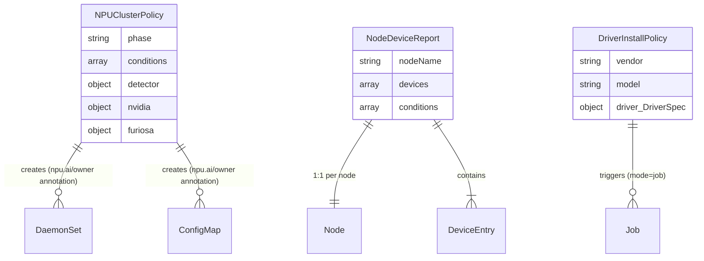
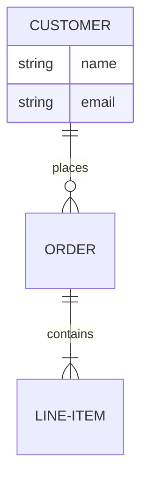

<!-- test_er.md: ER 다이어그램 변환 회귀 테스트 샘플 | 생성일: 2026-05-18 -->

# ER Diagram Smoke Test

본 문서는 erDiagram 변환 파이프라인(PNG / draw.io / PPTX)이 정상 동작하는지
회귀 검증하기 위한 샘플이다. 원본 다이어그램은 `mermaid_03.png` 참조.

## 1. CRD 관계도

## 2. 단순 ER

