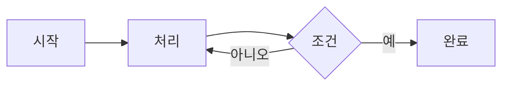

<!-- test_graph.md: graph TB + subgraph 변환 회귀 테스트 샘플 | 생성일: 2026-05-19 -->

# NPU Operator 아키텍처 — graph TB 회귀 테스트

본 문서는 graph TB + subgraph 변환 파이프라인(PPTX)의 시각 회귀를 검증한다.
원본 출력: `result_01.png` (회귀 전), 목표 출력: `gpt_01.png`

3대 시각 회귀 검증:
- (B1) 5개 subgraph 박스 겹침 없음
- (B2) 긴 라벨(NPUClusterPolicyReconciler 등) 박스 이탈 없음
- (B3) R1→R3, R1→R4 화살표가 NPUClusterPolicyReconciler 박스를 관통하지 않음
- (B4) edge label 이 노드 박스와 겹치지 않음

## 1. NPU Operator 전체 아키텍처

```mermaid
graph TB
    subgraph CP["Control Plane (ns: npu-operator)"]
        R1["Deployment: npu-operator-controller-manager"]
        R2["NPUClusterPolicyReconciler"]
        R3["DriverInstallReconciler<br/>(mode=job)"]
        R4["DriverDaemonSetReconciler<br/>(mode=daemonset)"]
        R5["DriverUpgradeReconciler<br/>(DUS 상태 머신)"]
    end
    subgraph CRD["CRDs (npu.ai/v1alpha1) — NCP: Namespaced, NDR·DIP·DUS: Cluster"]
        C1["NPUClusterPolicy"]
        C2["NodeDeviceReport"]
        C3["DriverInstallPolicy<br/>+ UpgradePolicy"]
        C4["DriverUpgradeState"]
    end
    subgraph W1["Worker Node (GPU — NVIDIA)"]
        W1D["detector Pod"]
        W1N["nvidia-device-plugin Pod"]
        W1Dr["driver Pod<br/>(mode=daemonset, privileged)"]
    end
    subgraph W2["Worker Node (NPU — Furiosa Warboy/RNGD)"]
        W2D["detector Pod"]
        W2F["furiosa-device-plugin Pod"]
        W2Dr["driver Pod<br/>(mode=daemonset, privileged)"]
    end
    subgraph W3["Worker Node (NPU — Rebellions / Tenstorrent)"]
        W3D["detector Pod"]
        W3R["rbln-device-plugin / tt-device-plugin Pod"]
    end

    DS1["DS: npu-op-detector"]
    DS2["DS: npu-op-device-plugin-nvidia"]
    DS3["DS: npu-op-device-plugin-furiosa"]
    DS4["DS: npu-op-device-plugin-furiosa-rngd"]
    DS5["DS: npu-op-device-plugin-rbln"]
    DS6["DS: npu-op-device-plugin-tenstorrent"]
    J1["Job: npu-op-installer-&lt;node&gt;"]
    DS7["DS: npu-op-driver-&lt;vendor&gt;-&lt;model&gt;"]
    N["Node"]

    R1 --> R2
    R1 --> R3
    R1 --> R4
    R1 --> R5
    C1 -->|"watches For()"| R2
    C2 -->|"watches For() + pred"| R3
    C3 -->|"Watches"| R3
    C3 -->|"watches For()"| R4
    C4 -->|"watches For()"| R5
    C2 -->|"Watches"| R5
    C3 -->|"Watches"| R5
    R2 -->|"ensure"| DS1
    R2 -->|"Nvidia.Enabled"| DS2
    R2 -->|"Furiosa.Enabled"| DS3
    R2 -->|"Furiosa.Rngd.Enabled"| DS4
    R2 -->|"Rebellions.Enabled"| DS5
    R2 -->|"Tenstorrent.Enabled"| DS6
    R3 -->|"creates"| J1
    R4 -->|"creates OnDelete DS"| DS7
    R5 -->|"cordon/drain/uncordon"| N
    W1D -->|"PCI scan 30s create/update NDR"| C2
    W2D -->|"PCI scan 30s create/update NDR"| C2
    W3D -->|"PCI scan 30s"| C2
    DS1 --> W1D
    DS1 --> W2D
    DS1 --> W3D
    DS2 --> W1N
    DS3 --> W2F
    DS4 --> W2F
    DS5 --> W3R
    DS6 --> W3R
    DS7 --> W1Dr
    DS7 --> W2Dr
```

## 2. 단순 graph (subgraph 없는 flowchart — 회귀 기준)

