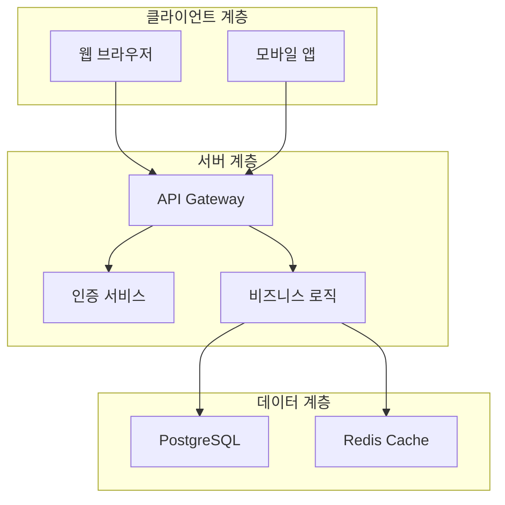
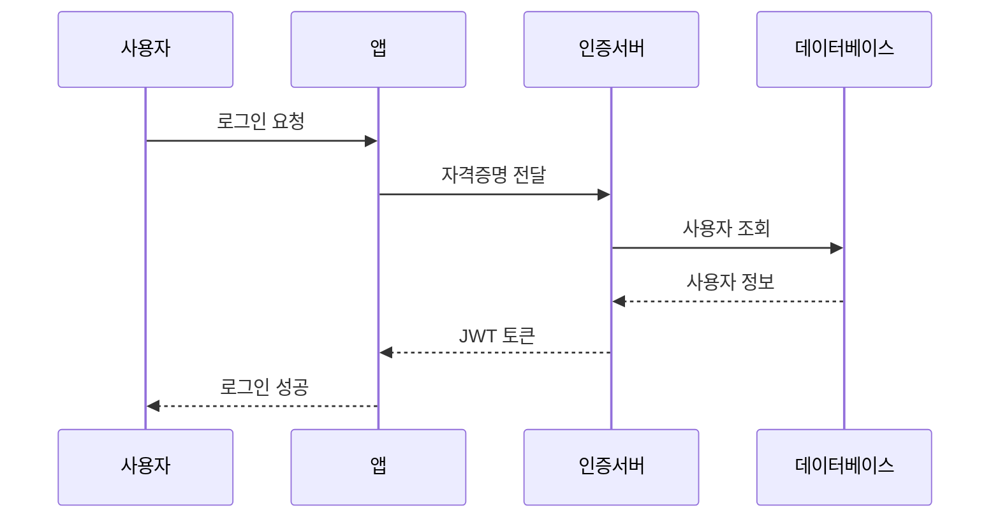
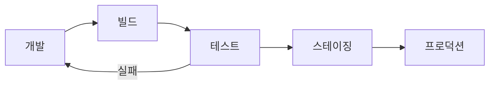

# 시스템 아키텍처

```mermaid
graph TB
    subgraph Client["클라이언트 계층"]
        Web["웹 브라우저"]
        Mobile["모바일 앱"]
    end
    subgraph Server["서버 계층"]
        API["API Gateway"]
        Auth["인증 서비스"]
        BL["비즈니스 로직"]
    end
    subgraph Data["데이터 계층"]
        DB["PostgreSQL"]
        Cache["Redis Cache"]
    end
    Web --> API
    Mobile --> API
    API --> Auth
    API --> BL
    BL --> DB
    BL --> Cache
```

## 사용자 인증 흐름

```mermaid
sequenceDiagram
    participant User as 사용자
    participant App as 앱
    participant Auth as 인증서버
    participant DB as 데이터베이스
    User->>App: 로그인 요청
    App->>Auth: 자격증명 전달
    Auth->>DB: 사용자 조회
    DB-->>Auth: 사용자 정보
    Auth-->>App: JWT 토큰
    App-->>User: 로그인 성공
```

## 배포 파이프라인

```mermaid
graph LR
    Dev["개발"] --> Build["빌드"]
    Build --> Test["테스트"]
    Test --> Stage["스테이징"]
    Stage --> Prod["프로덕션"]
    Test --> |실패| Dev
```
