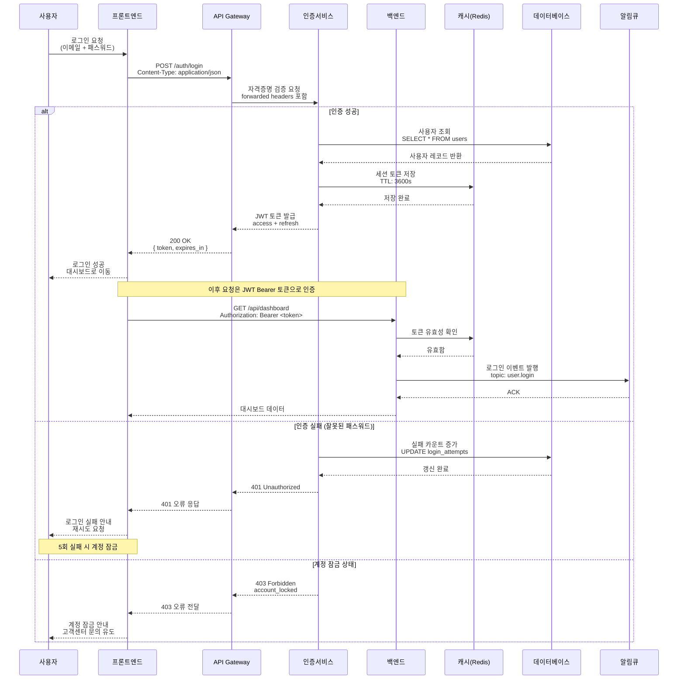
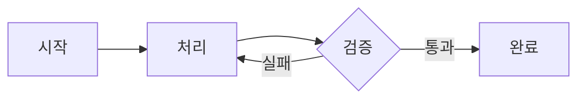
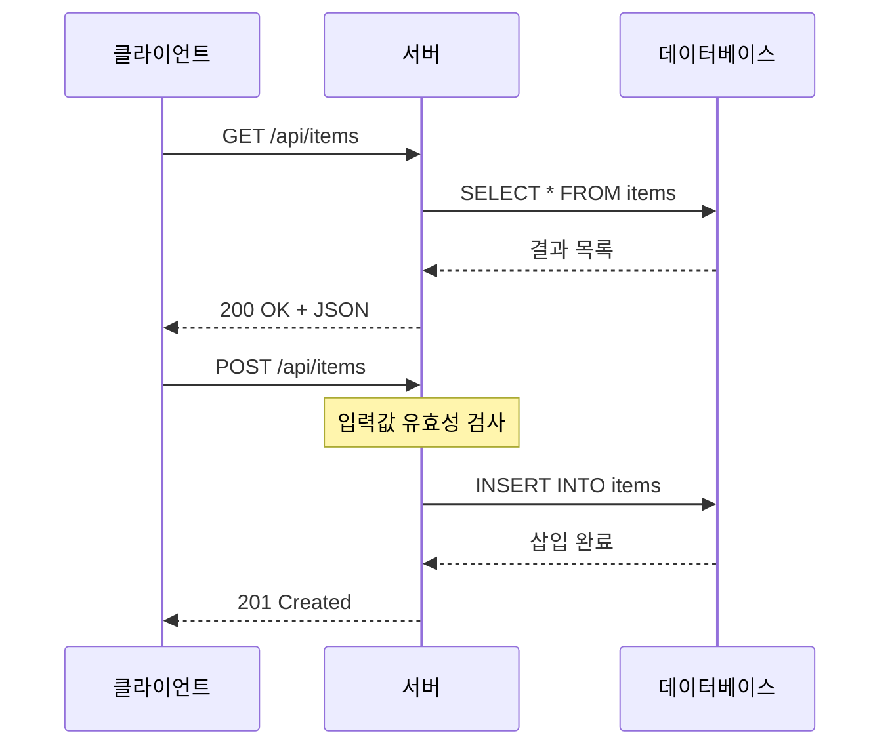
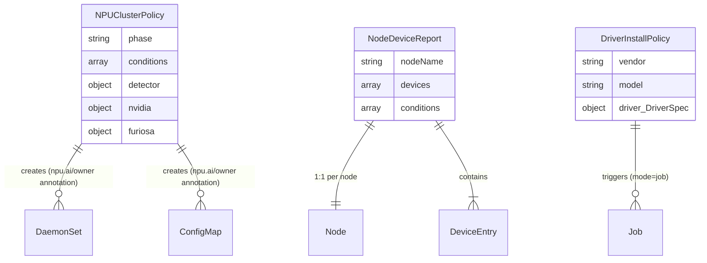

# sequenceDiagram 보강 검증 테스트

## 1번: 복잡 sequenceDiagram (alt + Note + br + 8 participants)

```mermaid
sequenceDiagram
    participant U as 사용자
    participant FE as 프론트엔드
    participant GW as API Gateway
    participant Auth as 인증서비스
    participant BE as 백엔드
    participant Cache as 캐시(Redis)
    participant DB as 데이터베이스
    participant NQ as 알림큐

    U->>FE: 로그인 요청<br/>(이메일 + 패스워드)
    FE->>GW: POST /auth/login<br/>Content-Type: application/json
    GW->>Auth: 자격증명 검증 요청<br/>forwarded headers 포함

    alt 인증 성공
        Auth->>DB: 사용자 조회<br/>SELECT * FROM users
        DB-->>Auth: 사용자 레코드 반환
        Auth->>Cache: 세션 토큰 저장<br/>TTL: 3600s
        Cache-->>Auth: 저장 완료
        Auth-->>GW: JWT 토큰 발급<br/>access + refresh
        GW-->>FE: 200 OK<br/>{ token, expires_in }
        FE-->>U: 로그인 성공<br/>대시보드로 이동
        Note over FE,BE: 이후 요청은 JWT Bearer 토큰으로 인증
        FE->>BE: GET /api/dashboard<br/>Authorization: Bearer <token>
        BE->>Cache: 토큰 유효성 확인
        Cache-->>BE: 유효함
        BE->>NQ: 로그인 이벤트 발행<br/>topic: user.login
        NQ-->>BE: ACK
        BE-->>FE: 대시보드 데이터
    else 인증 실패 (잘못된 패스워드)
        Auth->>DB: 실패 카운트 증가<br/>UPDATE login_attempts
        DB-->>Auth: 갱신 완료
        Auth-->>GW: 401 Unauthorized
        GW-->>FE: 401 오류 응답
        FE-->>U: 로그인 실패 안내<br/>재시도 요청
        Note over U,FE: 5회 실패 시 계정 잠금
    else 계정 잠금 상태
        Auth-->>GW: 403 Forbidden<br/>account_locked
        GW-->>FE: 403 오류 전달
        FE-->>U: 계정 잠금 안내<br/>고객센터 문의 유도
    end
```

## 2번: 단순 graph (회귀 기준)

```mermaid
graph LR
    Start["시작"] --> Process["처리"]
    Process --> Check{"검증"}
    Check -->|"통과"| Done["완료"]
    Check -->|"실패"| Process
```

## 3번: 단순 sequenceDiagram (alt 없는 회귀 테스트)

```mermaid
sequenceDiagram
    participant Client as 클라이언트
    participant Server as 서버
    participant DB as 데이터베이스

    Client->>Server: GET /api/items
    Server->>DB: SELECT * FROM items
    DB-->>Server: 결과 목록
    Server-->>Client: 200 OK + JSON

    Client->>Server: POST /api/items
    Note over Server: 입력값 유효성 검사
    Server->>DB: INSERT INTO items
    DB-->>Server: 삽입 완료
    Server-->>Client: 201 Created
```

## 4번: erDiagram 회귀 테스트 (5번 역할)

```mermaid
erDiagram
    NPUClusterPolicy ||--o{ DaemonSet : "creates (npu.ai/owner annotation)"
    NPUClusterPolicy ||--o{ ConfigMap : "creates (npu.ai/owner annotation)"
    NPUClusterPolicy {
        string phase
        array conditions
        object detector
        object nvidia
        object furiosa
    }
    NodeDeviceReport ||--|| Node : "1:1 per node"
    NodeDeviceReport {
        string nodeName
        array devices
        array conditions
    }
    DriverInstallPolicy ||--o{ Job : "triggers (mode=job)"
    DriverInstallPolicy {
        string vendor
        string model
        object driver_DriverSpec
    }
    NodeDeviceReport ||--|{ DeviceEntry : contains
```
