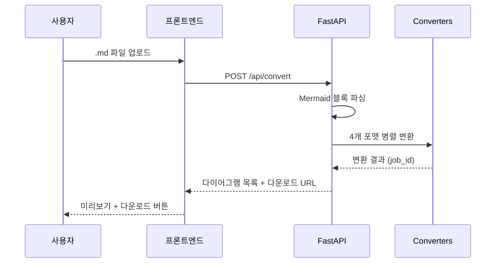

<!-- implementation.md: Mermaid Web Converter 구현 내용 요약 | 생성일: 2026-04-07 -->

# 구현 내용

## 개요

Mermaid Web Converter는 Markdown(.md) 파일에 포함된 Mermaid 다이어그램 코드블록을 추출하여 PNG, draw.io, Excalidraw, PPTX 4가지 포맷으로 자동 변환하는 웹 애플리케이션이다. FastAPI 백엔드와 바닐라 HTML/CSS/JS 프론트엔드로 구성되며, Docker Compose로 단일 명령 배포가 가능하다.

## 아키텍처

```
webapp/
├── backend/
│   ├── main.py            # FastAPI 서버 (API 엔드포인트)
│   ├── parser.py          # Mermaid 블록 추출 파서
│   ├── requirements.txt   # Python 의존성
│   └── converters/
│       ├── palette.py     # 공통 색상 팔레트
│       ├── png.py         # PNG 변환기
│       ├── drawio.py      # draw.io 변환기
│       ├── excalidraw.py  # Excalidraw 변환기
│       ├── pptx_shapes.py # PPTX 변환기 (편집 가능 도형)
│       └── pptx_combined.py # 합본 PPTX 생성기
├── frontend/
│   ├── index.html         # 단일 페이지 애플리케이션
│   ├── style.css          # 스타일시트
│   └── app.js             # 프론트엔드 로직
├── Dockerfile
├── docker-compose.yml
└── .env_example
```

**요청 흐름:**



## 변환 포맷

### PNG

PPTX 도형을 먼저 생성한 후 LibreOffice headless로 PNG 변환한다. 이 방식은 PPTX 변환기와 동일한 렌더링 파이프라인을 사용하므로 PPTX와 100% 동일한 시각적 결과를 보장한다.

LibreOffice가 설치되지 않은 환경에서는 mmdc(mermaid-cli)를 폴백으로 사용한다. mmdc 폴백 시 NanumSquare 폰트, base 테마, 노드별 색상 style 지시문을 자동 주입하여 일관된 외관을 유지한다.

### PPTX

python-pptx를 사용하여 네이티브 PowerPoint 도형을 직접 생성한다. 임베드 이미지가 아닌 편집 가능한 도형이므로 PowerPoint에서 텍스트, 색상, 크기를 자유롭게 수정할 수 있다.

주요 구현 특성:

| 항목 | 내용 |
|------|------|
| 커넥터 | ELBOW 타입 + 화살표 머리 (MSO_CONNECTOR) |
| 서브그래프 | 컨테이너 도형 + 제목 텍스트박스 2-도형 구조 |
| OOXML 보정 | `p:style` 요소 제거 (테마 색상 충돌 방지) |
| 그림자 | `a:effectLst` 초기화로 그림자 완전 제거 |
| 지원 타입 | flowchart, graph, sequenceDiagram |

### draw.io

mxGraph XML을 직접 생성한다. 노드 형태(사각형, 마름모, 원 등)를 Mermaid 문법에서 파싱하여 대응하는 mxGraph 스타일로 변환한다.

| Mermaid 문법 | 노드 형태 | draw.io 스타일 |
|-------------|---------|--------------|
| `ID[label]` | 사각형 | rectangle |
| `ID(label)` | 둥근 사각형 | rounded |
| `ID{label}` | 마름모 | diamond |
| `ID((label))` | 원 | circle |
| `ID[/label/]` | 평행사변형 | parallelogram |

엣지는 orthogonal 라우팅을 사용하고 16:9 페이지 사이즈로 레이아웃된다. NanumSquare 폰트와 노드별 팔레트 색상을 적용한다.

### Excalidraw

Excalidraw JSON 형식을 직접 생성한다. 다이어그램 방향(LR/TB)을 인식하여 수평 또는 수직 레이아웃을 자동 선택한다. 노드 색상은 팔레트 색상을 순환 적용한다.

시퀀스 다이어그램은 참여자를 수평으로 배치하고 메시지를 수직으로 나열하는 별도 레이아웃 로직을 사용한다.

### 합본 PPTX (combined.pptx)

`pptx_combined.py`가 각 다이어그램을 개별 PPTX로 생성한 후 슬라이드 XML을 직접 복제하여 단일 PPTX로 통합한다. 다이어그램이 2개 이상일 때 자동 생성되며, `POST /api/convert` 응답과 함께 즉시 사용 가능하다.

## 공통 디자인

모든 변환기는 `palette.py`의 통합 색상 팔레트를 공유한다.

| 팔레트 | 색상 수 | 용도 |
|--------|--------|------|
| NODE_COLORS | 8가지 | 노드 fill/stroke 색상 순환 |
| SUBGRAPH_COLORS | 6가지 | 서브그래프 배경/테두리 색상 |
| TEXT_COLOR | 1가지 | 모든 텍스트 (`#1e293b`) |
| LINE_COLOR | 1가지 | 엣지/커넥터 (`#475569`) |

공통 스타일 규칙:
- 테두리 두께: `Pt(0.75)` (PPTX), `strokeWidth: 1` (draw.io/Excalidraw)
- 폰트: NanumSquare (한글 지원)
- 모서리: 둥근 처리 (rx:8~10)

## API 엔드포인트

| 메서드 | 경로 | 설명 |
|--------|------|------|
| `GET` | `/health` | 헬스 체크 |
| `POST` | `/api/convert` | MD 파일 업로드 및 변환 실행 |
| `GET` | `/api/download/{job_id}/{index}/{format}` | 개별 파일 다운로드 |
| `GET` | `/api/download/{job_id}/combined-pptx` | 합본 PPTX 다운로드 |
| `GET` | `/api/download/{job_id}/all` | 전체 파일 ZIP 다운로드 |

지원 `format` 값: `png`, `drawio`, `excalidraw`, `pptx`

**POST /api/convert 응답 예시:**

```json
{
  "job_id": "550e8400-e29b-41d4-a716-446655440000",
  "diagrams": [
    {
      "index": 0,
      "title": "시스템 흐름",
      "formats": {
        "png": "/api/download/{job_id}/0/png",
        "drawio": "/api/download/{job_id}/0/drawio",
        "excalidraw": "/api/download/{job_id}/0/excalidraw",
        "pptx": "/api/download/{job_id}/0/pptx"
      },
      "preview": "/api/download/{job_id}/0/png"
    }
  ]
}
```

## Mermaid 파서 (parser.py)

MD 텍스트에서 ` ```mermaid ` 코드블록을 정규식으로 추출한다. 블록 직전의 마크다운 제목(`#`~`######`)을 다이어그램 제목으로 사용하며, 제목이 없으면 `Diagram N` 형식으로 자동 부여한다.

```python
# 핵심 파싱 패턴
pattern = re.compile(r"```mermaid\s*\n(.*?)```", re.DOTALL)
```

## 보안

| 항목 | 구현 방법 |
|------|----------|
| 경로 탐색 방지 | `job_id`를 UUID로 검증 후 `resolve()`로 절대 경로 확인 |
| 파일 크기 제한 | 업로드 10MB 초과 시 HTTP 413 반환 |
| 파일 형식 제한 | `.md` 확장자만 허용 |
| CORS | `allow_origins=["*"]` (내부망 배포 환경 기준) |

## 작업 디렉토리 구조

변환된 파일은 `backend/jobs/{job_id}/` 디렉토리에 저장된다.

```
jobs/
└── {job_id}/
    ├── diagram_0.png
    ├── diagram_0.drawio
    ├── diagram_0.excalidraw
    ├── diagram_0.pptx
    ├── diagram_1.png
    ├── ...
    ├── combined.pptx
    └── metadata.json
```

`metadata.json`은 합본 PPTX 재생성 시 원본 Mermaid 코드를 참조하는 데 사용된다. ZIP 다운로드 시 `metadata.json`은 제외된다.

> **참고:** jobs 디렉토리의 자동 정리(오래된 항목 삭제) 기능은 현재 미구현 상태이다. 운영 환경에서는 주기적인 수동 정리 또는 cron 기반 삭제 스크립트가 필요하다.
