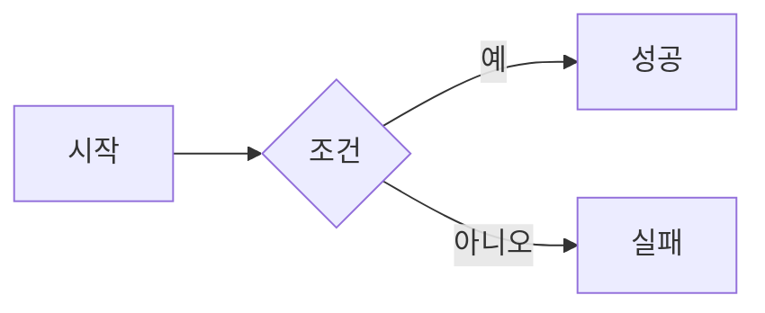

<!-- tutorial.md: Mermaid Web Converter 따라하기 구축 가이드 | 생성일: 2026-04-07 -->

# 따라하기: Mermaid Web Converter 구축 가이드

동일한 웹 애플리케이션을 처음부터 만드는 과정을 단계별로 설명한다.

## 사전 준비

| 항목 | 버전 | 용도 |
|------|------|------|
| Python | 3.10+ | 백엔드 서버 |
| Node.js | 20+ | mmdc(mermaid-cli) 실행 |
| LibreOffice | 최신 | PPTX→PNG 변환 (선택) |
| Docker + Docker Compose | 최신 | 컨테이너 배포 |

```bash
# 설치 확인
python3 --version
node --version
libreoffice --version
docker --version
```

---

## Step 1: 프로젝트 구조 생성

```bash
mkdir -p webapp/{backend/converters,frontend,docs}
touch webapp/backend/{main.py,parser.py,requirements.txt}
touch webapp/backend/converters/{__init__.py,palette.py,png.py,drawio.py,excalidraw.py,pptx_shapes.py,pptx_combined.py}
touch webapp/frontend/{index.html,style.css,app.js}
touch webapp/{Dockerfile,docker-compose.yml,.env_example}
```

최종 구조:

```
webapp/
├── backend/
│   ├── main.py
│   ├── parser.py
│   ├── requirements.txt
│   └── converters/
│       ├── __init__.py
│       ├── palette.py
│       ├── png.py
│       ├── drawio.py
│       ├── excalidraw.py
│       ├── pptx_shapes.py
│       └── pptx_combined.py
├── frontend/
│   ├── index.html
│   ├── style.css
│   └── app.js
├── Dockerfile
├── docker-compose.yml
└── .env_example
```

---

## Step 2: Python 의존성 설치

`backend/requirements.txt`:

```
fastapi>=0.115.0
uvicorn>=0.30.0
python-multipart>=0.0.9
python-pptx>=1.0.0
Pillow>=10.0.0
lxml>=5.0.0
aiofiles>=24.0.0
```

```bash
pip install -r webapp/backend/requirements.txt
npm install -g @mermaid-js/mermaid-cli
```

---

## Step 3: Mermaid 파서 구현 (parser.py)

MD 파일에서 ` ```mermaid ` 코드블록을 추출하는 파서를 구현한다.

**핵심 로직:**

```python
import re

pattern = re.compile(r"```mermaid\s*\n(.*?)```", re.DOTALL)

for match in pattern.finditer(md_text):
    code = match.group(1).strip()

    # 블록 직전 마크다운 제목을 다이어그램 제목으로 사용
    text_before = md_text[:match.start()].rstrip()
    last_line = text_before.split("\n")[-1].strip()
    heading_match = re.match(r"^#{1,6}\s+(.+)$", last_line)
    title = heading_match.group(1) if heading_match else f"Diagram {idx + 1}"
```

반환 타입은 `TypedDict`로 정의한다:

```python
class MermaidBlock(TypedDict):
    index: int
    title: str
    mermaid_code: str
```

---

## Step 4: 변환 엔진 구현

### 4-1. 공통 색상 팔레트 (palette.py)

모든 변환기가 동일한 색상을 사용하도록 팔레트를 공통 모듈로 분리한다.

```python
# (fill_hex, stroke_hex) 형식
NODE_COLORS = [
    ("#dbeafe", "#1e40af"),  # blue
    ("#d1fae5", "#047857"),  # green
    # ... 8가지
]

SUBGRAPH_COLORS = [
    ("#f5f3ff", "#7c3aed"),  # purple-tint
    # ... 6가지
]

def get_node_color(index: int) -> tuple[str, str]:
    return NODE_COLORS[index % len(NODE_COLORS)]
```

이 팔레트를 PNG, PPTX, draw.io, Excalidraw 모두 `from converters.palette import ...`로 가져와 사용한다.

### 4-2. PNG 변환기 (png.py)

PNG 변환은 2단계 폴백 전략을 사용한다:

```
1차: PPTX 생성 → LibreOffice headless → PNG
     (PPTX와 동일한 시각적 결과 보장)

2차 폴백: mmdc CLI로 직접 PNG 생성
          (LibreOffice 미설치 환경)
```

LibreOffice 변환 핵심:

```python
import subprocess

result = subprocess.run(
    ["libreoffice", "--headless", "--convert-to", "png", str(pptx_path)],
    capture_output=True, timeout=30, cwd=str(tmp_path),
)
```

mmdc 폴백은 노드별 색상 `style` 지시문을 Mermaid 코드에 자동 주입한 후 실행한다:

```python
# 노드 style 지시문 자동 주입 예시
style A fill:#dbeafe,stroke:#1e40af,stroke-width:1px,rx:10
style B fill:#d1fae5,stroke:#047857,stroke-width:1px,rx:10
```

### 4-3. PPTX 변환기 (pptx_shapes.py)

python-pptx로 네이티브 도형을 직접 생성한다. 핵심 구현 포인트:

**p:style 제거 (필수):** python-pptx가 자동으로 추가하는 `p:style` 요소는 직접 포매팅과 충돌하여 파일 손상을 유발한다. 모든 도형 생성 후 반드시 제거한다.

```python
def remove_style_element(element):
    style = element.find(qn("p:style"))
    if style is not None:
        element.remove(style)
```

**그림자 제거:** 기본 그림자 효과를 제거하여 깔끔한 외관을 유지한다.

```python
def _remove_shadow(shape):
    spPr = shape._element.find(qn("p:spPr"))
    etree.SubElement(spPr, qn("a:effectLst"))  # 빈 effectLst로 교체
```

**ELBOW 커넥터:** 노드 간 연결선은 `MSO_CONNECTOR.ELBOW` 타입을 사용하고 화살표 머리를 설정한다.

**서브그래프:** 배경 컨테이너 도형과 제목 텍스트박스 2개 도형으로 구현한다.

flowchart와 sequenceDiagram은 각각 별도의 파싱/레이아웃 함수로 처리한다.

### 4-4. draw.io 변환기 (drawio.py)

`xml.etree.ElementTree`로 mxGraph XML을 직접 생성한다.

노드 형태 파싱 패턴:

| Mermaid | 정규식 | 도형 |
|---------|--------|------|
| `ID[label]` | `(\w+)\[(.+?)\]` | rectangle |
| `ID(label)` | `(\w+)\((.+?)\)` | rounded |
| `ID{label}` | `(\w+)\{(.+?)\}` | diamond |
| `ID((label))` | `(\w+)\(\((.+?)\)\)` | circle |

엣지 스타일 파싱:
- `==>` → thick
- `-.->` → dashed
- `-->` → solid

페이지 설정은 16:9 비율(`mxGraph` 루트 속성)로 고정한다.

### 4-5. Excalidraw 변환기 (excalidraw.py)

Excalidraw JSON 스펙에 맞는 딕셔너리를 직접 생성한다.

다이어그램 첫 줄에서 방향을 파싱하여 레이아웃을 결정한다:

```python
# LR/RL → 수평 레이아웃, TB/BT → 수직 레이아웃
if "LR" in first_line or "RL" in first_line:
    direction = "LR"
else:
    direction = "TB"
```

각 요소는 `uuid.uuid4()`로 고유 ID를 부여한다. 노드(rectangle), 엣지(arrow), 텍스트(text) 요소를 `elements` 배열에 추가한다.

### 4-6. 합본 PPTX (pptx_combined.py)

각 다이어그램을 개별 PPTX로 생성한 후 슬라이드 XML을 복제하여 통합한다:

```python
# 슬라이드 XML 복제 핵심
for src_slide in single_prs.slides:
    blank_layout = combined_prs.slide_layouts[6]  # 빈 레이아웃
    new_slide = combined_prs.slides.add_slide(blank_layout)
    # src_slide의 spTree XML을 new_slide에 복사
```

---

## Step 5: FastAPI 서버 구현 (main.py)

### 앱 초기화

```python
from fastapi import FastAPI
from fastapi.middleware.cors import CORSMiddleware
from fastapi.staticfiles import StaticFiles

app = FastAPI(title="Mermaid Web Converter")
app.add_middleware(CORSMiddleware, allow_origins=["*"], ...)

JOBS_DIR = Path("./jobs")
JOBS_DIR.mkdir(exist_ok=True)
```

### POST /api/convert 핵심 흐름

```python
@app.post("/api/convert")
async def convert(file: UploadFile = File(...)):
    # 1. 확장자 검증 (.md만 허용)
    # 2. 파일 크기 검증 (10MB 제한)
    # 3. Mermaid 블록 파싱
    blocks = parse_mermaid_blocks(md_text)

    # 4. job_id 생성 및 디렉토리 준비
    job_id = str(uuid.uuid4())
    job_dir = JOBS_DIR / job_id

    # 5. 4개 포맷 변환 (각각 try/except로 부분 실패 허용)
    for i, block in enumerate(blocks):
        png_bytes = mermaid_to_png(mermaid_code, title)
        drawio_content = mermaid_to_drawio(mermaid_code)
        excalidraw_data = mermaid_to_excalidraw(mermaid_code)
        pptx_bytes = mermaid_to_pptx(mermaid_code)

    # 6. metadata.json 저장 (합본 PPTX용)
    # 7. 합본 PPTX 생성 (2개 이상 시)
```

### 보안: 경로 탐색 방지

```python
# UUID 형식 검증
_uuid.UUID(job_id)  # ValueError → HTTP 400

# 절대 경로 검증
file_path = (JOBS_DIR / job_id / filename).resolve()
if not str(file_path).startswith(str(JOBS_DIR.resolve())):
    raise HTTPException(status_code=400)
```

### 라우트 선언 순서 주의

`/api/download/{job_id}/combined-pptx` 라우트는 반드시 `/api/download/{job_id}/{index}/{format}` 보다 먼저 선언해야 FastAPI가 올바르게 매칭한다.

### 프론트엔드 정적 파일 서빙

API 라우트를 모두 선언한 후 마지막에 마운트한다:

```python
app.mount("/", StaticFiles(directory="../frontend", html=True), name="frontend")
```

---

## Step 6: 프론트엔드 구현 (index.html / app.js)

### 업로드 UI

드래그 앤 드롭과 클릭 업로드를 모두 지원하는 drop zone을 구현한다:

```javascript
dropZone.addEventListener("dragover", (e) => {
    e.preventDefault();
    dropZone.classList.add("drag-over");
});

dropZone.addEventListener("drop", (e) => {
    e.preventDefault();
    const file = e.dataTransfer.files[0];
    if (file?.name.endsWith(".md")) uploadFile(file);
});
```

### 변환 요청

```javascript
async function uploadFile(file) {
    const formData = new FormData();
    formData.append("file", file);

    const response = await fetch("/api/convert", {
        method: "POST",
        body: formData,
    });
    const data = await response.json();
    renderDiagrams(data.diagrams, data.job_id);
}
```

### 결과 렌더링

각 다이어그램 카드에 PNG 미리보기와 포맷별 다운로드 버튼을 렌더링한다. 합본 PPTX 다운로드와 전체 ZIP 다운로드 버튼은 다이어그램이 1개 이상일 때 표시한다.

---

## Step 7: Docker 배포

### Dockerfile 핵심 구성

```dockerfile
FROM python:3.10-slim

# Chromium + Node.js + NanumSquare 폰트 설치
RUN apt-get update && apt-get install -y \
    chromium fonts-nanum nodejs \
    && npm install -g @mermaid-js/mermaid-cli

# Puppeteer가 시스템 Chromium 사용하도록 설정
ENV PUPPETEER_SKIP_CHROMIUM_DOWNLOAD=true
ENV PUPPETEER_EXECUTABLE_PATH=/usr/bin/chromium

WORKDIR /app
COPY backend/ /app/backend/
COPY frontend/ /app/frontend/
RUN pip install -r /app/backend/requirements.txt

WORKDIR /app/backend
CMD uvicorn main:app --host 0.0.0.0 --port ${PORT:-8205}
```

### docker-compose.yml

```yaml
services:
  mermaid-converter:
    build: .
    ports:
      - "${PORT:-8205}:${PORT:-8205}"
    environment:
      - PORT=${PORT:-8205}
    volumes:
      - ./jobs:/app/backend/jobs
    restart: unless-stopped
```

`volumes` 설정으로 컨테이너 재시작 시에도 변환된 파일이 유지된다.

### .env_example

```bash
# 이 파일을 .env로 복사 후 수정
PORT=8205
```

포트 변경 시:

```bash
cp .env_example .env
# .env에서 PORT=9000 으로 수정
docker compose up -d
```

---

## Step 8: Nginx 리버스 프록시 설정

도메인으로 서비스를 제공하거나 HTTPS를 적용할 때 Nginx를 앞단에 둔다.

```nginx
server {
    listen 80;
    server_name mermaid.example.com;

    location / {
        proxy_pass http://127.0.0.1:8205;
        proxy_set_header Host $host;
        proxy_set_header X-Real-IP $remote_addr;
        proxy_set_header X-Forwarded-For $proxy_add_x_forwarded_for;
        proxy_set_header X-Forwarded-Proto $scheme;
        client_max_body_size 10M;  # MD 파일 크기 제한과 일치
    }
}
```

`client_max_body_size 10M`은 FastAPI의 10MB 파일 크기 제한과 맞춰야 한다. Nginx 기본값(1MB)을 그대로 두면 대용량 MD 파일 업로드가 Nginx 단계에서 차단된다.

설정 적용:

```bash
sudo nginx -t               # 문법 검사
sudo systemctl reload nginx # 적용
```

---

## 검증

모든 단계 완료 후 아래 순서로 동작을 확인한다:

```bash
# 1. 헬스 체크
curl http://localhost:8205/health
# {"status": "ok"}

# 2. 변환 테스트
curl -X POST http://localhost:8205/api/convert \
  -F "file=@test.md" | python3 -m json.tool

# 3. 개별 파일 다운로드 확인
curl -O http://localhost:8205/api/download/{job_id}/0/png
```

**테스트용 MD 파일 예시 (`test.md`):**

````markdown
## 흐름도 예시


````
