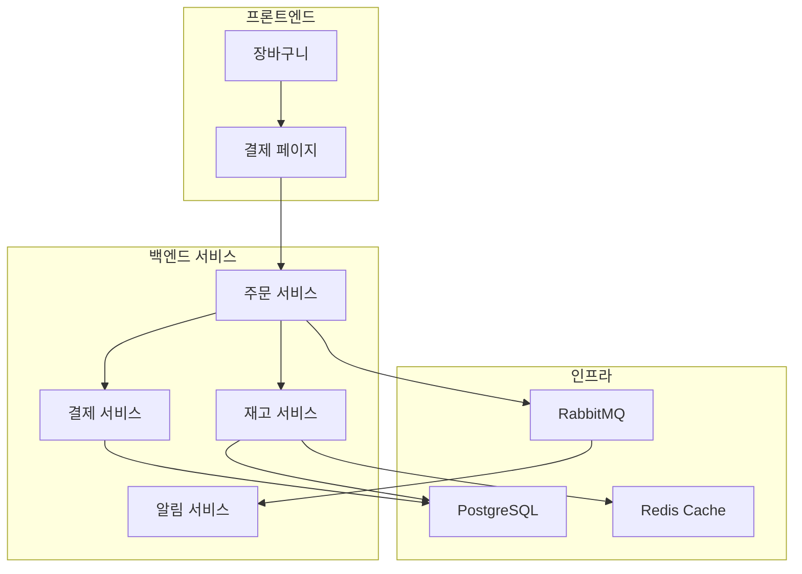
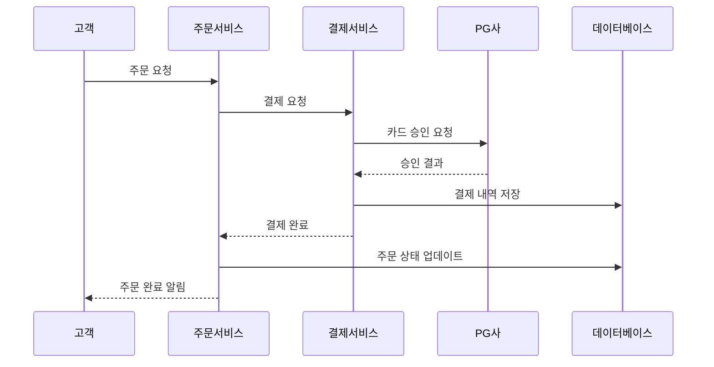
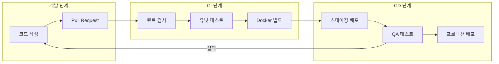

# 온라인 쇼핑몰 시스템

## 주문 처리 흐름

```mermaid
graph TB
    subgraph Frontend["프론트엔드"]
        Cart["장바구니"]
        Checkout["결제 페이지"]
    end
    subgraph Backend["백엔드 서비스"]
        OrderSvc["주문 서비스"]
        PaySvc["결제 서비스"]
        InvSvc["재고 서비스"]
        NotiSvc["알림 서비스"]
    end
    subgraph Infra["인프라"]
        DB["PostgreSQL"]
        MQ["RabbitMQ"]
        Redis["Redis Cache"]
    end
    Cart --> Checkout
    Checkout --> OrderSvc
    OrderSvc --> PaySvc
    OrderSvc --> InvSvc
    PaySvc --> DB
    InvSvc --> DB
    InvSvc --> Redis
    OrderSvc --> MQ
    MQ --> NotiSvc
```

## 결제 시퀀스

```mermaid
sequenceDiagram
    participant User as 고객
    participant Order as 주문서비스
    participant Pay as 결제서비스
    participant PG as PG사
    participant DB as 데이터베이스
    User->>Order: 주문 요청
    Order->>Pay: 결제 요청
    Pay->>PG: 카드 승인 요청
    PG-->>Pay: 승인 결과
    Pay->>DB: 결제 내역 저장
    Pay-->>Order: 결제 완료
    Order->>DB: 주문 상태 업데이트
    Order-->>User: 주문 완료 알림
```

## CI/CD 파이프라인

```mermaid
graph LR
    subgraph Dev["개발 단계"]
        Code["코드 작성"]
        PR["Pull Request"]
    end
    subgraph CI["CI 단계"]
        Lint["린트 검사"]
        Test["유닛 테스트"]
        Build["Docker 빌드"]
    end
    subgraph CD["CD 단계"]
        Stage["스테이징 배포"]
        QA["QA 테스트"]
        Prod["프로덕션 배포"]
    end
    Code --> PR
    PR --> Lint
    Lint --> Test
    Test --> Build
    Build --> Stage
    Stage --> QA
    QA --> Prod
    QA --> |실패| Code
```
